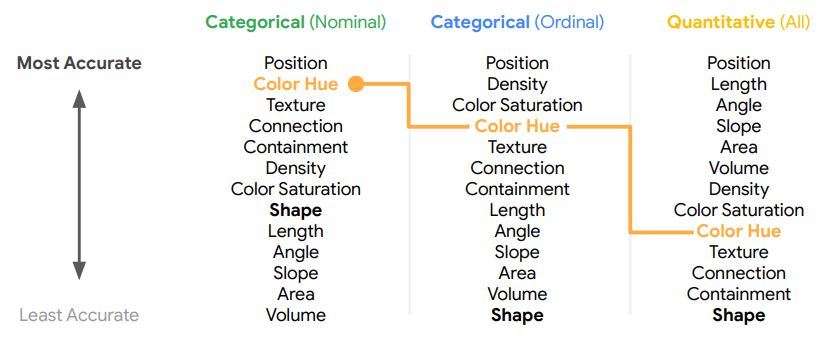
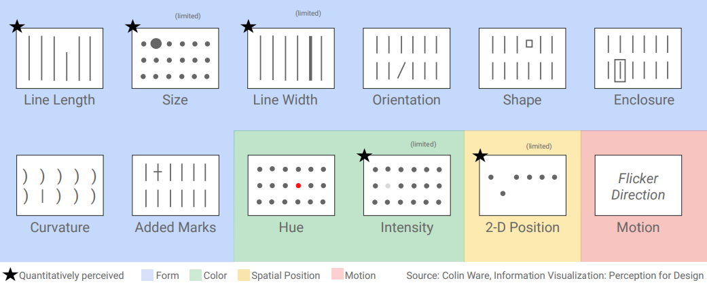

# Data Visualisation - Exam Notes
---
## **Part I - Foundations**
- Lectures: 1-3
- Chapters: 1-2
- Cheat Sheet: Visual_Vocabulary.pdf

---
### *What is a visualization?*
The book defines;
- **Visualization**: An umbrella term for any kind of visual
- **Chart**: An encoding of data with symbols (synonyms: "plot", "graph", "diagram")
- **Infographic**: A multi-section visual communicating one or more specific messages; Shows a small amount of data, and has focus on the story.
- **Data Visualization**: A display of data to *enable analysis, exploration and discovery*; conceived as tools to gain insights / make your own conclusions.
- **News Application**: A visualization allowing people to relate the data to their own personal life. Can, for example, be a tool helping you decide between health care options near you.

---
### *Why do we visualize?*
- **vision** is the most powerful of all of our senses.
- Just looking at numbers, it can be hard to find patterns and come to conclusions - using visual cues to display the data helps the brain in analysing and exploring data. **Patterns become apparent**.
- We are drowning in data - we need to make sense of it in a way that summary statistics cannot grasp!

---
### *What are the 5 qualities of a good visualization?*
The 5 qualities as defined by *Enrico Bertini*:
- **Truthful**: A visualization that is honest and truthful, is not trying to mislead you (intentionally or unintentionally). Do not hide data, excessively summarize data and be aware of your own perception and bias. Apply *critical thinking* whenever you sort, filter and display data!
- **Functional**: A visualization that is functional, will help the audience interpret the data correctly. We want to show our points in a way that the brain can easily understand, *purpose* is the focus.
- **Beautiful**: A visualization that is beautiful, will be interesting to the audience and make them more motivated to spend time interpretting it. Beauty is *subjective* and out goal is therefore designing to be *experienced as beautiful by as many people as possible*.
- **Insightful**: A visualization that is insightful, will clear the path to making valuable discoveries. Visualizations are not just pictures, they need to award us new knowledge. Consider:
    - *Spontaneous Insights*: You see it right away; "a-ha" moment.
    - *knowledge-building insights*: gradual process of exploration to build knowledge.
- **Enlightening**: A visual that is enlightening, is a graphic that has all the other 4 qualities and excel at *changing people's minds for the better*. Enlightening the user / reader of the visualization means making a difference in the way they perceive the world or a particular topic.

---
### *Can you give me a meaningful visual vocabulary?*
Depending on your use-case you might want to deploy a different model (or several models) to best help your audience achieve insights... but how do you find out which type of visual to use? 

One good tool is to use visual vocabulary overviews as the one located in this folder; *Visual_vocabulary.pdf !* Further suggested ressources can be found in the slides of lecture 3, but here are a few:
- [Data Viz Project](https://datavizproject.com/)
- [Data Viz Cataloque](https://datavizcatalogue.com/)
- [Visualising Data](http://chartmaker.visualisingdata.com/) - solutions for particular visuals in particular programs (i.e. Tableau, R, Pandas, Flourish)
- [Xenographics](https://xeno.graphics/) - has a lot of interesting and weird plots!

---
---

## **Part II - Visual Perception**
- Lectures: 4
- Chapters: 5 + additional reading
- Cheat Sheet: -
---
### *What is the visual hierarchy?*
The *Hierarchy of elementary perceptual tasks* was put together by two statisticians to rank how easy it is for humans to accurately estimate numbers based on different visual properties. 

This hierarchy is built solely on *ease of interpretation* for the human brain. The Hierarchy goes from accurate estimates -> general estimates:
- Position along common scales
- Position along identical non-aligned scales
- Length
- Direction / slope
- Angle - Area
- Volume
- Shading
- Color Hue

The higher in the hierarchy your main encodings come from, the easier it is for the intended audience to come to conclusions and make good estimates. **BUT** it always depends on the use-case - for specific purposes a lower rated encoding might provide a better contextual meaning to the reader than ones higher up in the hierarchy.

*Hierarchies are slightly different depending on type of variable* they say...

---
### *What is it with human visual perception?*
**Attention** has it's limits - we have all tried those weird games where your overlook changes because you are focused on something else... If not, i can recommend watching Brain Games (can be found on Disney+)!

Our brains are good at detecting things that **stand out**, but find it hard to f.ex. count the number of items in a crowd. Some attributes make items stand out more than others!

---
### *How can i create visuals that are effective in the different channels?*
There are 5 types of channel effectiveness that we will consider:
- **Accuracy**: how accurately can I estimate values?
- **popout**: how easily can I spot one value over the rest?
- **discriminability**: how many different values can I perceive?
- **seperabillity**: how well can I seperate different encodings?
- **grouping**: how well can I perceive groups?

For **Accuracy** we should follow the *visual hierarchy*! But, it does depend on the type of variable (Nominal, Ordinal, qualitative) - see more details under the *visual hierarchy* section :D

For **popout** we should leverage *pre-attentive processing*, which is what we perceive automatically and without much thought. View the *pre-attentive processing* section for further details.

For **discriminability** we should be aware of the number of different values within an encoded attribute. One might consider *binning* to lessen the amount of different types within an encoding type that might be hard to distinguish.

For **seperability** we should ensure choosing attribute encodings that interfere as little as possible: height-width or color-color a problematic, while placement-color is easy to perceive both encodign at the same time!

For **grouping** we should apply *gestalt principles* which rank channels in terms of how well they communicate groups. View the *gestalt principles* section for further details.

---
### *What is pre-attentive processing?*
Pre-attentive processing is what happens before we start that actual processing of data. It is the perception that happens automatically.
An overview of pre-attentive attributes can be seen in the below image.

---
### *What are the Gestalt Principles?*
The gestalt principles is a ranking of how different properties helps us in decoding grouping information in data. Here they are in order:
- **proximity**: Objects close to each other are often perceived as having *similar characteristics*.
- **similarity**: Objects with distinct similarities (color, shape) appear to have similar characteristics; useful for grouping categories.
- **segregation**: Objects that are within a box / circle appear to be sharing some *similar characteristics*.
- **connectivity**: Objects that are connected (f.ex. dots connected by a line) appear to be of a *similar/same* group.
- **continuity**: Objects are expected to continue following the smoothest path possible. (especially with lines...)
- **closure**: Objects with missing data points are expected to follow a smooth path between the two endpoints. (smooth interpolation -> similar point to continuity!)

---
---

## **Part III - Visualization Choices**
- Lectures: 5-6
- Chapters: 5 
- Cheat Sheet: Building_Charts_Cheatsheet.pdf
---
### *What are some basic rules for choosing a chart vs. table?*
**Tables** are awesome when we want to be precise, compare specific values or want to look up a specific value.

**Charts** are awesome when we want an overview and try to reveal patterns / relationships.

---
### *Tell me about Data Ink vs. non-Data Ink!*
Data Ink is used to describe things in a chart directly displaying / related to the data we are trying to show. Non-Data Ink on the other hand is all the extra things - legend, axes, numbers, labels, grid lines etc.

We want to **minimize non-Data Ink** to the point where our point just comes across and the chart is readable for the audience. We basically want to remove clutter and redundant information, to allow the audience to focus on what is important; the data!

---
### *Give me the main design points to consider!*
- **Minimize non-data ink**: Remove clutter and allow focus solely on the data.
- **Place axis where relevant**: If your interesting insights are at the top, place your axis there!
- **Consider aspect ratios**: When your plot is taller, lines will look too ragged. When your plot is wider, lines will look too smooth. 
- **Consider orientation**: Sometimes a horizontal bar plot will give your data more space and allow more easily reading the data.
- **Use soft color palettes**: to allow ease of reading the chart, allow possibility to enhance particular points with saturated colors. **ALSO** remember to be color-blind sensitive!
- **Be consistent with colors**: Use the same color for that same item across charts. This will make it easier for the audience to spot trends.
- **Remember the rules of thumb**: at max; 5 lines, 10 bars, 7 slices and 8 colors!

---
### *What can you tell me about visualising networks?*
First things first, there's three main things we consider when visualising networks; node attributes, edge attributes and layout. Here we will shortly go through some best practices.

When it comes to **node attributes** we have a few tools:
- *node size*: the bigger a node is, the more important it is! (consider degree, centrality measures or a given attribute - *quantitative*)
    - Fall-pit 1: We model using the radius, but the brain conceives importance in terms of area! We should ensure that distinctions are based on area of node :D
    - Fall-pit 2: We cannot actually see the difference in sizes... We should enhance the differences!
    - Fall-pit 3: Some nodes becomes way too big, others become invisible... We should make the scale exponential instead of linear, to ensure a nicer overview.
- *node color*: To display *qualitative* information. (community, category etc.)
    - CAN be used for quantitative attributes with diverging / sequential color schemes, but thes should be avoided!
- *node labels*: not really relevant unless you actually need them for interpretation and cannot put them in tool-tip... Basically a glorified wordcloud when you add labels :D

When it comes to **edge attributes** we have many of the same tool (and fall-pits) as with nodes:
- *edge thickness*: corresponds 1:1 with node size :D
- *edge color*: VERY different from node color... Edges rarely have any type of qualitative information worth visualizing, **BUT** for big hairballs we can use *edge transparency* to make it less hair-ball-y.
- *edge labels*: please just dont... really only if it's a life-or-death!

When it comes to **network layouts** we have several different algorithms to help us get a better layout that allows a better overview of the network.
- *Force-Directed layouts*: Works well for sparse, clustered and sphered networks! Allows clusters / groups to be densely connected while adding distance betweens node groups with fewer inter-links. Ordered from least compact to most compact:
    - Spring Embedded
    - Force Directed
    - Organic
    - Compound Spring Embedded
- *t-SNE layout*: is a wild dimensionality reduction, that produces a single set of coordinates that can be used to plot the network.
- *hierarchical layout*: really only works for trees or DAGs... 
- *circular layout*: an interesting layout, but remember to consider: 
    - How you arange nodes is important
    - Consider using edge-bends to display "highways" between clusters.

---
---

## **Part IV - I Am Now a Designer**
- Lectures: 7-8
- Chapters: -
- Cheat Sheet: Beautiful_Charts_Cheatsheet.pdf
---
### *What are the design ideas we should consider in information design?*
One thing we might consider is the **task** that the audience will need to do to understand and use our visualization. The usual workflow and *information seeking mantra* that we might use as a guideline is:

*Overview First, Zoom and Filter, then Details-on-Demand*

Another thing is the usefulness / **goal** of visualising. We might consider it a tool for a very specific purpose, or to retain several uses depending on the application.

The main **problem-solving tasks** we try to solve with visualisation are:
- *Exploratory tasks*: helps the user make their own exploration of the data.
- *confirmatory tasks*: helps the user test a hypothesis.
- *production-based tasks*: helps user visualise their proven hypothesis.

We also consider **actions** and **targets**. When you have a desired task, you often phrase it as an action you want to use towards a target. *Actions* can be analytical (discover, derive, present), comparison (compare, identify) or search (lookup, explore) and *targets* can both be broad (trends, features, outliers) or specific (correlation, extremes).

---

### *Can you tell me about the design proces?*
Designing anything is an **iterative proces**. We start by making a draft with just the bare essentials, test it out (possibly on representatives of the audience) and make some changes to accommodate whatever was unclear or weird.

Secondly, we should attempt to apply design principles through **design thinking**:
- *user first*: design for the user of whatever your are designing, as they are the ones that are going to benefit and be annoyed by the end-product.
- *it's not the user's fault*: we should design all things to be intuitive to use... if we fail, it will cause a lot of frustrations for our end users.
- *always observe*: everything around us is designed by someone. Be aware of your surroundings, and observe how people and things interact.

---
### *What are Normans 4 design principles?*
Design principles are unique to each organisation and to each visualisation designer. Thus this is just one suggestion making some good points:
- **Affordances**: A good design ensures that the intended actions are easy to see, while unintended actions are hidden. Affordances are *all possible actions*!
- **Constraints**: Ensure fewer errors by the user by constraining unintended actions to become impossible!
- **Conceptual Models**: Our minds get frustrated when we have to learn how to use a seemingly arbitrary tool / object.
- **Feedback**: Any design needs to give some sort of feedback to allow the user to know something changed following their action - pushed a button, changed a slicer etc.

**Rule of Thumb**: If you need a sign to tell the user how to use it, the design is ineffective!

---
### *What is the Von Restorff effect?*
The Von Restorff effect describes, that the item that *stands out* is the most likely to be remembered by the user. This might f.ex. be a button that is bright blue while everything else is gray, or a highly saturated bar in a bar chart where everything else has soft colors. I.e. it *draws attention* and creates a *meaningful memory* for the user.

---
### *Now, what can you tell me about aestethics in data viz?*
Beauty is all subjective. Not all people will find the same things beautiful, but yat there are 3 main types of beauty: 

- *dynamic* beauty leverages unexpectedness and flow, 
- *harmonious* beauty leverages flawless interaction between nice parts and 
- *inherent* beauty leverages the contrast towards an opposite.

But why do we even care about aestethics and things being beautiful? well...
- It makes the user comfortable in **spending more time** exploring the data.
- It helps in relation to **persuading** someone of your points (usability/effectiveness).
- It makes the visualization **memorable**.
- It awards more **clarity**.

Often, all we need is to **declutter** and make data as easy and intuitive to view and manage as possible!

---
### *But what is all that 'Graphical Excellence' about then?*
Graphical excellence is all about giving the viewer/user the most use of a visualization with as little ink and space as possible (Tufte's definition at least).

It's basically a lot about Data Ink ratio, meaning we want as high a fraction, of things shown in a visualization, to be directly related to the data as possible.

It's also a lot about small multiples and spark lines in relation to *as little space as possible*. Since small multiples and sparklines are effective in showing each their own story / trends but do not take up too much space...
---

# Highlights
## *Overview First, Zoom and Filter, Details on Demand!*
---
---
## **What are the 5 qualities of a good visualization?**
The 5 qualities as defined by *Enrico Bertini*:
- **Truthful**: A visualization that is honest and truthful, is not trying to mislead you (intentionally or unintentionally). Do not hide data, excessively summarize data and be aware of your own perception and bias. Apply *critical thinking* whenever you sort, filter and display data!
- **Functional**: A visualization that is functional, will help the audience interpret the data correctly. We want to show our points in a way that the brain can easily understand, *purpose* is the focus.
- **Beautiful**: A visualization that is beautiful, will be interesting to the audience and make them more motivated to spend time interpretting it. Beauty is *subjective* and out goal is therefore designing to be *experienced as beautiful by as many people as possible*.
- **Insightful**: A visualization that is insightful, will clear the path to making valuable discoveries. Visualizations are not just pictures, they need to award us new knowledge. Consider:
    - *Spontaneous Insights*: You see it right away; "a-ha" moment.
    - *knowledge-building insights*: gradual process of exploration to build knowledge.
- **Enlightening**: A visual that is enlightening, is a graphic that has all the other 4 qualities and excel at *changing people's minds for the better*. Enlightening the user / reader of the visualization means making a difference in the way they perceive the world or a particular topic.

---
## **What is the visual hierarchy?**
The *Hierarchy of elementary perceptual tasks* was put together by two statisticians to rank how easy it is for humans to accurately estimate numbers based on different visual properties / encodings. 

This hierarchy is built solely on *ease of interpretation* for the human brain. The Hierarchy goes from accurate estimates -> general estimates:
- Position along common scales
- Position along identical non-aligned scales
- Length
- Direction / slope
- Angle
- Area
- Volume
- Shading
- Color Hue

---
## **How can i create visuals that are effective in the different channels?**
There are 5 types of channel effectiveness that we will consider:
- **Accuracy**: how accurately can I estimate values?
- **popout**: how easily can I spot one value over the rest?
- **discriminability**: how many different values can I perceive?
- **seperabillity**: how well can I seperate different encodings?
- **grouping**: how well can I perceive groups?

For **Accuracy** we should follow the *visual hierarchy*! But, it does depend on the type of variable (Nominal, Ordinal, qualitative) - see more details under the *visual hierarchy* section :D

For **popout** we should leverage *pre-attentive processing*, which is what we perceive automatically and without much thought. View the *pre-attentive processing* section for further details.

For **discriminability** we should be aware of the number of different values within an encoded attribute. One might consider *binning* to lessen the amount of different types within an encoding type that might be hard to distinguish.

For **seperability** we should ensure choosing attribute encodings that interfere as little as possible: height-width or color-color a problematic, while placement-color is easy to perceive both encodign at the same time!

For **grouping** we should apply *gestalt principles* which rank channels in terms of how well they communicate groups. View the *gestalt principles* section for further details.

---

## **What are the Gestalt Principles?**
The gestalt principles is a ranking of how different properties helps us in decoding grouping information in data. Here they are in order:
- **proximity**: Objects close to each other are often perceived as having *similar characteristics*.
- **similarity**: Objects with distinct similarities (color, shape) appear to have similar characteristics; useful for grouping categories.
- **segregation**: Objects that are within a box / circle appear to be sharing some *similar characteristics*.
- **connectivity**: Objects that are connected (f.ex. dots connected by a line) appear to be of a *similar/same* group.
- **continuity**: Objects are expected to continue following the smoothest path possible. (especially with lines...)
- **closure**: Objects with missing data points are expected to follow a smooth path between the two. (smooth interpolation -> similar point to continuity!)

---

## **Give me the main design points to consider!**
- **Minimize non-data ink**: Remove clutter and allow focus solely on the data.
- **Place axis where relevant**: If your interesting insights are at the top, place your axis there!
- **Consider aspect ratios**: When your plot is taller, lines will look too ragged. When your plot is wider, lines will look too smooth. 
- **Consider orientation**: Sometimes a horizontal bar plot will give your data more space and allow more easily reading the data.
- **Use soft color palettes**: to allow ease of reading the chart, allow possibility to enhance particular points with saturated colors. **ALSO** remember to be color-blind sensitive!
- **Be consistent with colors**: Use the same color for that same item across charts. This will make it easier for the audience to spot trends.
- **Remember the rules of thumb**: at max; 5 lines, 10 bars, 7 slices and 8 colors!

---

## **What are Normans 4 design principles?** 
Design principles are unique to each organisation and to each visualisation designer. Thus this is just one suggestion making some good points:
- **Affordances**: A good design ensures that the intended actions are easy to see, while unintended actions are hidden. Affordances are *all possible actions*!
- **Constraints**: Ensure fewer errors by the user by constraining unintended actions to become impossible!
- **Conceptual Models**: Our minds get frustrated when we have to learn how to use a seemingly arbitrary tool / object.
- **Feedback**: Any design needs to give some sort of feedback to allow the user to know something changed following their action - pushed a button, changed a slicer etc.

**Rule of Thumb**: If you need a sign to tell the user how to use it, the design is ineffective!

---

## **What is the Von Restorff effect?**
The Von Restorff effect describes, that the item that *stands out* is the most likely to be remembered by the user. This might f.ex. be a button that is bright blue while everything else is gray, or a highly saturated bar in a bar chart where everything else has soft colors. I.e. it *draws attention* and creates a *meaningful memory* for the user.