# Exam Notes - Second Year Project
On subjects concerning Natural Language Processing from basics to complex language modelling. The Lecturers surround the following subjects:

---
---
## PART I - Basics
Lectures: 1-2

---
### *What is "Natural Language Processing" about?*
Most data in this world is unstructured free text data. 
Being able to 'understand' and analyze texts the same way humans do in a computerized way is the ultimate goal of of the field. 
The field consists of a large variety of different tasks and methods that help interpret and process free text (Natural Language) or even information extraction for search algorithms like google.

Natural Language Processing is an **important** field, because it helps us communicate more effectively (helping us re-phrase, put commas and spell-check) even across languages and cultures (computer translation).

There are many diverse challenges in language, that do not fit how a machine works. Machines need to take very specific instructions to produce very specific results. Some challenges include:
- **sentiment classification** is an interesting subfield where the *meaning* of words (or sequences of words) make a difference to the human understanding of either a positively or negatively loaded sentence.
- When **generating language** the order and form of words is also an essential part of formulating a comprehensible and correct sentence for the circumstance.
- A huge challenge is also **ambiguous** words or even entire sentences. On their own they might have several very different meanings and use cases. Ambiguity might manifest itself on many different levels of language (*lexical*, *syntax*, *semantics*, *pragmatics*)

---
### *What is a Token?*
Here are a few important distinctions when we talk about *tokenizing* a text / string:
- A **character** is a single letter, symbol, space or similar
- A **string** is a sequence of characters
- A **token** is a collection of characters in a single meaningful group (could be a word with/without punctuation)

---
### *How do i use RegEx to extract meaningful tokens (Tokenization)?*
Regular Expressions can be used to define specific patterns of characters that we would like to extract. The following notations may be used in any combination:
- **[12abc]** - any single character between the brackets is matched
- **[A-Z]** - any single character within the range (here, uppercase letters)
- **[^abc]** - the '^' negates the brackets - and thus matches any single character not otherwise within the brackets.
- **a|b** - matches one of EITHER of string a or b
- **ab?** - matches 'a' followed by *0 or 1* 'b'
- **ab*** - matches 'a' followed by *0 or more* 'b'
- **ab+** - matches 'a' followed by *1 or more* 'b'
- **.** - matches any character

Further nice-to-knows:
- **^(regex)** - matches the regex if it is at the *start* of the line.
- **(regex)$** - matches the regex if it is at the *end* of the line.
- **\s** - matches whitespaces

But **How do we determine how to tokenize?**
There are several methods; we might either define a regular expression to describe what a gap between tokens look like.... or, we might define what the tokens themselves should look like!
- **Defining gaps**: problematic, as we likley dont handle punctuation too well!
- **Defining tokens**: problematic, as we might have words that dissappear because our regex pattern does not match them!
- **lexicon-based**: 're.compile(\<string>).findall(\<language>)'... but this is also complex af

---
### *How do i proces text in the LINUX command line?*
Using the commandline in general is important, as this is also how we would work with ITU HPC (High Performance Computer)!

**Syntax:** \<command> -\<option> \<value> \<input>

#### **Basic commands:**
- **cat** : print contents of file to StdOut
- **head** / **tail** : print beginning or end of files
    - **-n \<number>** : specify number of lines to fetch
- **wc** : wordcount of file (outout: #lines, #words, #characters, filename)
    - **-c** : characters only
    - **-w** : words only
    - **-l** : lines only
- **less** : Interactive reading of file
    - **scrolling** : space/enter/arrowkeys
    - **/** : searching
    - **q** : quit interactive application
- **pipe** : **a|b** : use to pass output from action 'a' to action 'b'
- **redirect** : **> filename.txt** : use to write output to file 

#### **Text Processing:**
- **grep "regexp" filename.txt** : matches a regular expression and returns all matches by default
    - **-i** : ignore capitalization
    - **-o** : match only regexp
    - **-n** : show line numbers
    - **-c** : count lines that match
    - **-v** : invert
- **sort filename.txt** : sorts the content of a file
    - **-n** : numeric
    - **-r** : reverse order
- **uniq** : removes adjacent duplicate lines
    - **-c** : return count
- **cut** / **paste** : for splitting / pasting columns in a file
    - **-d** : delimiter (default is tab)
    - **-f** : select fields
- **tr "FIND_STRING" "REPLACE_STRING"** : replace characters in string from StdIn
- **sed** : filtering and transforming text (used for replacing)
    - **-i** : inplace
    - **sed "s;FIND_STRING;REPLACE_STRING;g"**

---
### *What should i consider in a basic experimental setup?*
#### The first thing we consider is **splitting** into train-(dev/val)-test sets. This is important to:
- ensure integrity of our results, and 
- determine some kind of confidence in our predictions. 
- BUT! Beware... data *in the wild* often have a lot of unexpected behaviors. (i.e. the challenge of **domain adaption**)

Note, that using a **stratified split** is common practice. I.e. we split the data based on a criteria, like; *time, document, main speaker, write/speaker*, and ensures that our estimated performance resembles a real life situation the best!

A commonly used method is **k-fold** validation, for which the data is split into *k* sections. Then the model is fit and validated k times, with each fold being the validation data once.

#### The next thing we need to consider is **baselines**, for which we have several options;
- The simplest possible approach (predicting to the most common sample)
- A simple classifier (f.ex. logistic regression)
- The state-of-the-art (for which we want to make improvements by use of some method)

Which baseline to use depends on the research question, but the better the baseline, the more relevant an answer we will produce from our results.

#### The third thing to consider is **which metric** we should base our analysis / model selection / reporting on. Some basic rules for choosing a metric:
- If the metric used in previous work makes sense, use that too!
- Use a metric the reflects the *goal* of the system.

Some common metrics that we should consider:
- *Accuracy*: fraction of correct predictions
    - Good for balanced label distributions
- *Recall*: for a class, number of instances (Ground Truth) correctly classified
- *Precision*: for a class, number of predictions correctly classified
- *F1-score*: harmonic mean between recall and precision
    - Per class: remember there are different averages to consider! (weighted, macro, micro, etc.)
- *Span-F1*: F1-score for span-based tasks (NER)

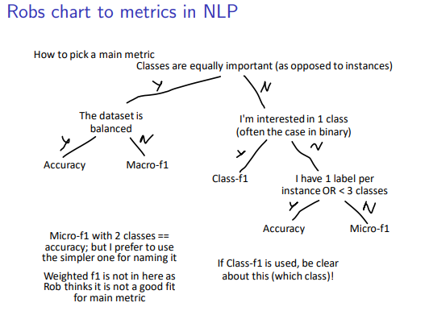

#### We might also be interested in **statistical significance** of our results. For that we can consider the following methods:
- *paired bootstrap* (i.e. t-test for equal means)
    - Bootstrap n random samples of prediction
    - calculate significance of model A performing better than model B
- *ASO test* (Almost Stochastic Order)
    - For comparing multiple versions of the same model
    - [Github Repo W. Implementation](https://github.com/Kaleidophon/deep-significance)

**REMEMBER** - Often Quantitative and Qualitative approaches compliment each other a lot!

---
---
## PART II - Data Collection and Basic Modelling
- Lectures: 3-5
- [Interesting report on Datascience](https://visit.figure-eight.com/rs/416-ZBE-142/images/CrowdFlower_DataScienceReport.pdf)

---
### *How do I get data?*
There are 2 main approaches for selecting data for a project:
- **Top-down**: We specify our *task* first and try to find data to work with later.
- **Bottom-up**: We find the *data* first, and determine our tasks based on what is available.

A popular source for natural language data is **scraping** or using **open APIs**... But the problems with this type of data gathering is that we cannot freely re-distribute the data, offering *challenges in terms of reproducibillity* as we cannot share data.

Whenever we have a new dataset it is important to create a **dataset statement** that specifies a variety of things (find [guides](https://techpolicylab.uw.edu/wp-content/uploads/2021/10/Data_Statements_Guide_V2.pdf) online). We should always be clear about the origin and possible biases of our dataset, as we can never guarantee a dataset to be completely representative of a population. See below picture from the slides for main parts that should be present in a dataset statement:
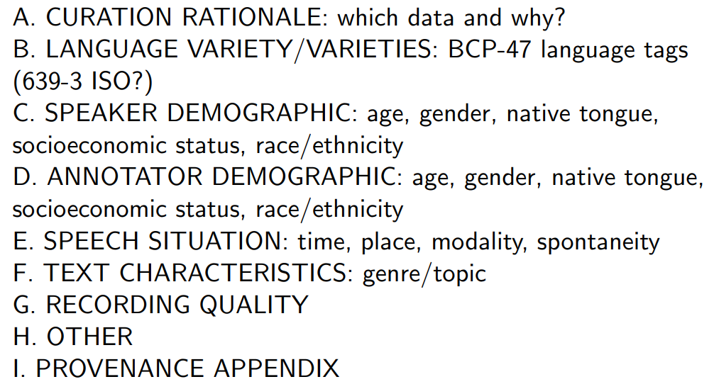

**biases** can appear from many different things; examples from data collection processes are speaker demographics (who answers a survey) or sampling method (we only gather data from internet / by phone limiting the reachable demographic).

---
### *Once I have some cool data, how do I obtain annotations?*
Once we have data and determine to annotate it for some type of task, we will need to obtain these annotations from somewhere credible.

When we have **Human Annotations** we are bounded by how well *humans* can do the task we want to obtain *gold standards* for. Note that some tasks are harder than others, and the demographic of annotators might sometimes only be linguists to ensure proper gold standards.
Human annotations are also **expensive**, so we often use a small part of the data to *iteratively* let annotators learn the guidelines by heart and discuss ambiguous cases / refine guidelines. Once the **kappa score** converges, we divide the rest of the dataset by the number of annotators and let it be annotated by a single individual.

We consider all annotations and guidelines to be a trade-off between:
- *Informativity*: The most useful annotations for your task / goal.
- *Correctness*: Easier cases will ensure higher correctness than complex cases.

There exists **freely available** annotated datasets for a lot of tasks - sentiment analysis, author identification, language modelling etc. These can be used, but be aware of their dataset statements and annotation guidelines, as you should *always validate* the integrity of things produced by others, to ensure that you trust the results.

---
### *What are the practicalities of setting up an annotation proces?*
Human Annotations are obtained through an **iterative proces**, consisting of the four steps:
- *Model and Guidelines*: here we define the way we annotate. Include good examples and examples of hard cases for annotators to review.
- *Annotate*: A selection of data items are annotated by groups of annotators (at least two)
- *Evaluate*: The annotation are evaluated (think, intra- and inter-annotator aggreement :D)
- *Revise*: Revise the types of errors and difficult / ambiguous cases - then go back to reviewing and updating step 1!

When defining the **Annotation Guideline** we should think of them as instructions that should not be possible to misinterpret. The main questions we should ensure to answer are:
- What is the purpose?
- What is each label called and how is it used? (include examples for clarity)
- What parts of the text do you want annotated?
- How are difficult cases handled? (including indicators for ambiguity / uncertainty)

For **Evaluating** annotations we usually work with *inter-annotator agreement* (i.e. agreement between annotators). But how do we measure agreement? well, that really depends on the task, but here are some cool options to consider:
- *Cohen's Kappa*: (observed_agreement - agreement_by_chance) / (1 - agreement_by_chance)
    - Takes chance into account
    - scale is 0-1 (0 equals random guessing)
    - Good for 2 annotators
- *Fleiss Kappa*:
    - Takes chance into account
    - scale is 0-1 (0 equals random guessing)
    - Good for >2 annotators

How do i calculate agreement_by_chance? (Remember, the more classes, the lower the expected agreement will become!)
Here is a small example from class, including cohen's kappa calcualtion:
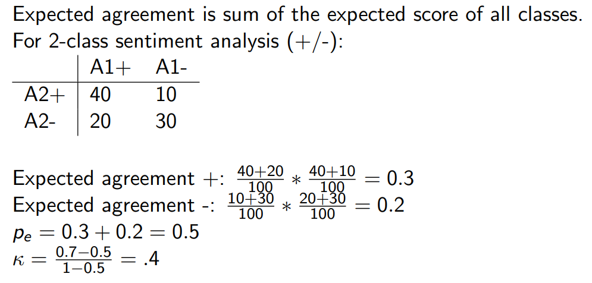

**rule-of-thumb** for interpreting Kappa:
- 0 = Random
- <0.4 = Weak
- 0.4-0.6 = moderate
- 0.6-0.8 = strong
- 0.8-0.99 = almost perfect
- 1 = perfect

---
### *What is Sequence Labeling?*
Sequence labellng describes any type of task that labels each element in a sequence. Real-world applications include Part-Of-Speech tagging, Named Entity Recognition and many more!

In particular, a sequence labeling task takes an input vector in length *s* of elements, and produces an output vector of labels in the same length. It is a particular type of *structured prediction problem* where we predict each label based on some classifier model.

When using it for Named entity recognition, we know that some entities might span several tokens. We might benefit from using BIO or more complicated labelling techniques:
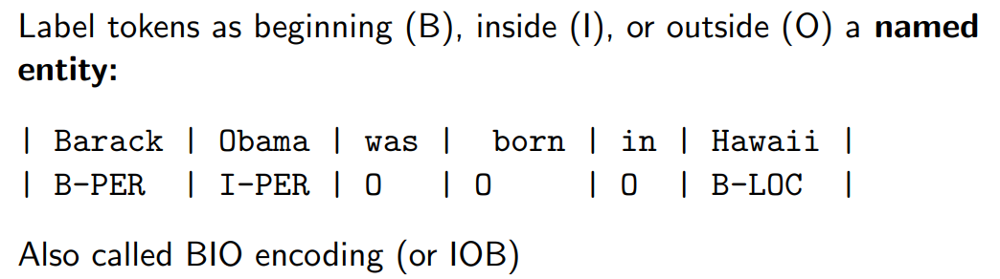

---
### *Tell me a little more about Part-of-Speech Tagging*
Part-Of-Speech Tagging is a sequence labelling topic for which we assign each token in a sentence with the related grammatical tag (i.e. punctuation, verb, determiner, nound, pronoun etc,)
A good rule for determining a class of a word, is that replacing it by another word of the same class should not impact syntactical correctness!

There exists many different tag-sets, but for simpler tasks we might want to stick to the *Universal POS tags* (12-17 tags). The Penn Treebank tag-set is a more granular tag-set consisting of 45-52 tags (verbs are f.ex. divided into tenses)

We can define two main groups of tags when we consider part-of-speech:
- **closed class** : classes that have a relatively fixed set of words
    - prepositions (on, under, over, near, by, at, from, to, with)
    - particles (up, down, on, off, in, out, at, by)
    - determiners (a, an, the, many, some, all, no, which, what, this, that)
    - coordinating conjunctions (and, or, as, if, when) - syntactically equal parts
    - pronouns (she, who I, others)
    - auxiliary verbs (can, may, should, are, was, is, will) - function word to express grammatical distinction
    - numerals (one, two, three, first, second, third)
    - adposition (in, for, at, from, by, as) - relations connected to nouns
- **open class** : 
    - adjectives (honest, pretty, cool, ugly, silent) - modifies nouns
    - adverbs (never, quite, actually) - modifies verbs, adjectives or adverbs
    - interjections (please, thanks, yes, well, lol, hey, ok)
    - nouns (wine, glasses, history, science)
    - proper nouns (Emma, Bilka, ) - named objects / entities
    - verbs (lived, stinking, creating)
    - pronoun (his, nothing, my, he, we)
    - subordinate conjunctions (but,, for, if) - syntactically subordinating parts
- **other** : anything un-classified
    - punctuation (!, ., ?)
    - symbols (#, @, $, %, :D)
    - X (miscellaneous!)

---
### *How do i use words as features?*
The simplest way of encoding words as features is to use something similar to the concept of One-Hot Encoding. I.e. we create a vector of 0's in the length of the vicabulary (i.e. unique words), and for each sentence we put a 1 for those tokens that are present in the set of tokens. 

This method is called **Bag-of-Words**, as we disregard the context of the tokens and any ambiguity of word meanings. If we encounter spelling mistakes or unknown words, we quickly fail to have proper support... but natural language is incredibly *sparse* - i.e. few very frequent words, many rare words (**Zipf's law**)

---
### *How does Machine Learning in NLP differ from other areas?*
We have been used to model either *regression* problems or *classification* problems when we work with predictors, but sometimes we have a more complex type of prediction. 
NLP is just that type of area, where we might want to predict a word to a class, but do it for a **whole sequence** and take *contextual information* into account as well! 
F.ex. we might even attempt to classify an **entire text** to a class, i.e. spam / not spam.

But, like all other prediction tasks, we consider two main types of features:
- *High-level* : also referred to as "engineered" features, as they are based on assumptions and hypotheses created by ourselves. These are very task-dependent!
- *Low-level* : any features we can derive directly from the source, but we still need to pick and choose what makes sense for the model to consider!

---
### *Describe Bag-of-Words, Lemmatisation and Stemming in short*
**Bag-of-Words** is the approach for which we consider only the set of words representing a sequence or text, keeping counts but disregarding all other information. We might also consider **Bag-of-N-grams** as a possible improvement introducing mroe granularity and context (but also sparsifying occurrences!).

Both *Lemmatisation* and *Stemming* is useful for reducing the vocabulary size, as words of the same origin are often used in similar meaning.
**Lemmatisation** is when we reduce words to their (dictionary) base form.
**Stemming** is when we remove endings following a particular set of rules to *approximate* lemmas.

---
### *Tell me a bit about N-grams and basic Embeddings*
**N-grams** is a spin-off on how we considered individual words (tokens) as features - now we simply consider small *sequences of n tokens*, often depicted in tuples or similar.

**Embeddings** on the other hand, is where we provide a vector of numbers as a representation for each word / token. This vector is randomly initialised and updated during training by f.ex. a neural network (using gradient descent)!

---
### *Describe some basic classifiers for Sequence Labelling*
When we had machine learning we learned about **Bayes Optimal Classifier** -> the classifier that classifies to the class with the highest probability. We want to simplify this to a **Naive Bayes** by assuming features as independent -> a word occurring is not dependent on other words occurring.

When we fit our Naive Bayes Classifier we fit it to the training data using maximum likelihood (i.e. we find the parameters providing the highest likelihood of our training corpus). Remember this from applied stats? 
**Note** that decision boundaries of Naive Bayes are *linear*!

Instead of modelling joint distribution (as above) we might want to simply model **conditional distributions**. I.e. we model the probability of a class given the features. This might f.ex. be a **logistic sigmoid** where we model the probability of a class. Due to our independence assumptions we simplify p(y|X) for each xi to be p(y|xi).

Remember to use **regularisation** to avoid overfitting to specific features - i.e. a rare word will be strongly associated with a single category, and rare words are inevitable (zipf's law). To use regularisation we simply add a penalty to the loss function to penalise high coefficients! (remember, from machine learning?)

---
### *How can i use N-grams for Language Modelling?*
First of the first questions should probably be... what is a *Language Model* even? I'm glad you asked! Usually we define language models as those that solve one of two related tasks:
- Computes the probability of an entire sentence
- Computes the probability of an upcoming word (i.e. to find the most likely continuation of the current unfinished sentence)

It is generally used for either figuring out how likely a particular sentence is compared to another, or for similarly comparing several words to find the best continuation of the current sentence.

What a language model does is compute the **probability of seeing a sequence of words**. we use the *chain rule* to determine that:
- P(w1, w2, ... , wd) is equal to
- P(w1) * P(w2 | w1) * P(w3 | w1, w2) * ... * P(wd | w1, w2, ..., w(d-1))
- In simpler words: for each word in a sequence we calculate it probability, given the history; P(w|h)

To get around having to find all possible histories (not feasible!) there are several solutions:
- **Count-based Language Models** (traditional)
    - We use the Markov assumptions to estimate parameters! (read more in the next section)
- **Neural Language Models** (modern)
    - Will be covered in later parts

---
### *What is the Markov Assumption and how are they used for sequence labelling?*
Firstly, we'll have a look at what the **Markov assumption** is;
- Follows the idea of N-grams!
- We can approximate the history by looking solely at the last few words. (This is the Markov Assumption)
- I.e. we decide on an *n*, and then we only consider the last *n-1* tokens of history! (truncate history)

The most basic we can consider then, is of course the **1-gram (unigram) Language Model**, but this will only consider the probability of the word itself (likely leading to some pretty interesting sentences if used to predict further words). We might also consider **Higher-order LMs** where we might f.ex. consider bi-grams or trigrams or words.

With the Markov assumption and a specific order of n-gram decided we can estimate paramters in a **count-based** method. We do this by using the count of occurences of each (n-1)-gram and n-gram!
This is used to calculate the fraction: 
- count(n-gram) / count(related (n-1)-gram)

---
### *How do i evaluate my Language Model?*
WE might consider one of two possible ways of evaluating performance: 
- **extrinsic** evaluation : we look at improvements in downstream tasks
- **instrinsic** evaluation : we look at improvements in the model itself

We want to consider **perplexity** for *intrinsic* evaluations. 
Perplexity is the *inverse probability of the test set, normalized by the number of words. The lower the score, the better (ranges from 1 to infinity!) 
Beware of cheating yourself, as a higher n-grams will give you better perplexity on training data, but also not generalize too well on dev or test data! What it does mostly, is become a parrot and repeat the exact phrases you gave it! Overall here are some pointers:
- Higher n-grams give higher perplexity (on training data at least!)
- Perplexity approximates the average number of choices for each word position
- perplexity is undefined for words not in the vocabulary.

---
### *How should I handle Out-of-Vocabulary (OOV) Tokens?*
Let's think of some overall solutions:
- Remove unseen words from test corpus (nope!)
- Replace unseen words with an \<UNK> token!
    - Method 1: all words with less than *n* occurences -> UNK
    - Method 2: define vocabulary first, then mark all unseen words UNK
- Move probability mass to unseen words! (Smoothing)

Smoothing solves the problem of overestimating probability of seen words and underestimating probability of rarer words. We might consider several methods of smoothing depending on our use case:
- Laplace Smoothing: Add-1 estimate (add 1 count to each occurence)
    - Mass is assigned uniformly
- Interpolation: use P((n-1)-gram) to estimate P(n-gram).
    - This is equal to using the *back-off* (n-1) model :D

---
### *Please explain Markov Chains (and Hidden Markov Models)*
**Markov chains** describe a set of items Q with a matrix of transition probabilities A and initial probabilities pi. Markov chains can be defined for Part-of-Speech tags in their sequential order, to model how on type **transitions** to another.
In Part-of-speech tagging we also consider the chain to start at the begginning token 'start' and finish at the end token 'stop'.

But where do transition probabilities (A) and initial probabilities (pi) come from? we simply **estimate probabilities** based on a human-annotated dataset in the target domain!
We estimate probabilities by dividing a probability mass of 1 between all outgoing links of a node, depending on the count of occurrences where the destination node type follows the initial node type in a sequence.

We introduce **Hidden Markov Models** as the model that, given a sentence, will compute the most likely sequence of labels for the observation. This model has two assumptions:
- Words only relate to their label, and not to previous words / labels.
- bi-gram assumption: tags are only dependent on the 1 preceding tag

---
### *How does Viterbi algorithm work?*
Viterbi uses Markov chains and Markov assumption, and is therefore a quite efficient algorithm. When we compute the algorithm we often choose to use *negative log probabilities* as they have higher precision and are more efficient (add instead of multiply!)

For Viterbi we take one token at a time, considering every possible path. For each "path" we note:
- P(w|t) : emission probability - probability of word having the tag
- P(t|t(at -1)) : transition probability - probability of tag given previous tag
- P(h) : probability of history (starting tag = 1, otherwise the probability of the path "thus far" at the previous step)

Once we have al of these for a specific node and a specific path, we add them together to produce a probability. At each node (after step 1) we will highlight the path with the highest probability (smallest log-probability) and specify this as the most likely path up to and including the tag defined. See below pictures for example:
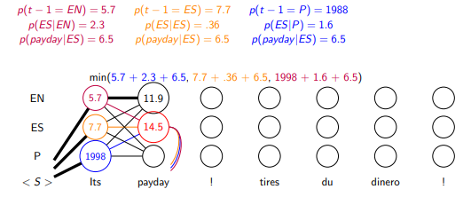
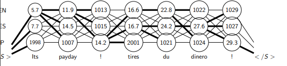

Note, that in the end we have only one link to the "stop" marker, end then we will backtrack our link to "start" to produce the most likely sequence!

---
---
## PART III - Basic Embedding based Methods (+Bias)
Lectures: 6-7 + 13

---
### *How are FFNN's used with language?*
Using Feed Forward Neural Networks (FFNNs) is often referred to as **Deep Learning** - as we use networks with many layers.
Previously, NLP machine learning techniques have been cenetered around high-level features derived in a certain way and defined based on domain knowledge. 

The **new order** of machine learning in NLP relies less on engineered features, and instead *build neural networks* which take raw words and (hopefully) learn to induce features through training.

**FFNNs in short:**
- FFNNs are layered:
    - *n* input features = *n* input nodes
    - *k* hidden layers, with any number of nodes in each
    - *m* output features = *m* output nodes (usually logistic for binary, softmax for multiclass)
- All nodes in layer i and i+1 are connected by a signal. (**fully connected**)
    - In each neuron incoming signals (x) are summed: z = w * x + b
    - Then the sum is *activated*: a(z) 
    - Activation function can be sigmoid, tanh, ReLU, Leaky ReLU
- Networks are trained using **stochastic gradient descent**!
    - Weights are initialised at random
    - Updated during training **back-propagation**... (after a *forward pass* has produced a *loss*)
    - using the derivative chain-rules (as we want the derivative in terms of the parameter we want to update!)

The main **benefits** of neural networks:
- *non-linearity* : we can make non-linear (more complex) decision boundaries
- *representational power* : we can move to a higher representational power of the initial data. (in deed a layer of sum + activate can be seen as a *projection* of data)

---
### *How do i represent words for a Neural Network?*
Previously we talked about **Bag-of-Words**, which is a *sparse binary* sentence representation, as it is a vector in the length of the vocabulary with only few non-zero entries! 
This method might also be reffered to as *n-hot vector* encoding.
We might even consider *Bag-of-N-Grams* or *Bag-of-Character-N-Grams* as further options for different granularity / generality.

We move into the world of **word embeddings** which creates *dense continuous* feature representations. The idea is to create a vector with *d* features for every single word in the vocabulary, initialise the feature values at random and update them through training!
The entire collection of word embeddings for the vocabulary is usually kept in a matrix **E** of size |V| * d.

When doing a **look-up** to find a word embedding vector, we usually use a 1-hot encoding vector for the word, and multiply tis with the matrix E to obtain a single embedding vector.
Since sentences are of **variable length** we need to consider how to project them down to a single vector of length *d*. We might consider:
- **CBOW**: we simply sum word embedding vectors for the entire sentence

---
### *What is a CRF Layer?*
FFNN's have a huge take back, as it is not equipped to consider surrounding predictions, and we want to find a way to consider context!

CRF layers is a layer placed **on top of the network** -> before outputting predictions, but after the last layer of activations... It considers the output from the network as *emission probabilities*, and withholds within itself the transistion probabilities. -> we can apply limitations by deciding on some label transistions having a probability of 0.

CRF layers are *not available in PyTorch*

---
### *What is WordNet, and how does it help us model word meaning?*
WordNet is a *thesaurus*. It is a **lexicon** containing word senses and relations between different word senses (i.e. both duck *the animal* and duck *the movement*). 
Word senses are then grouped into **synsets**... or, sets of synonyms as a normal human being might say. 

**from nltk.corpus import wordnet**
- Each word has a varying number of synsets it might belong to, depending on the meaning. (some words have many, some few)
- Each synset contains information about *definition* and *examples* as well as *hypernyms*
- *hypernyms* are word senses that are more general but describe the same -> 'duck' might become 'bird' before it becomes 'animal' etc.

The main **points of concern** for WordNet are:
- The most common meaning is not correct in all contexts.
- It is not kept up-to-date with how language evolves (new words, new meanings)
- Does not support typos / variants of words
- Human created - subjective and hard labor!
- Mainly supports English

---
### *Contextual Embeddings - How does it work, and why?*
The core idea of this comes from the fact, that meanings of words can often be derived by the words surrounding it - *the company it keeps*.
We want to define a good representation as one that has distinct representations for each word, but also similar representations for words of similar meaning!

First we want to establish how to measure **similarity** between two embedding vectors, to ensure that we excell at the goal!
- **Hamming Distance** : We count (in slides, opposite original theory) the number of equal items in the vectors.
    - Does not work for orthogonal vectors! (i.e. one-hot)... Distance is not defined for orthogonal vectors D:
- **Cosine Similarity** : Cosine similarity bounds in the formula for calculating the angle between vectors. *(dot(v1,v2)/(len(v1)*len(v2)))*
    - score of 1 = 0 degrees = identical
    - score of -1 = 180 degrees = opposites
    - score of 0 = 90 / 270 degrees = orthogonal

The core concept of contextualized word embeddings is doing **unsupervised learning** on a large training corpus. But how do we do this?
- **Count-Based** (traditional) : we represent a word by a vector of counts of occurrences in *d* unique documents. 
- **Co-occurence** : We represent company of the word as a *context matrix* (entire document, paragraph, few words on either side...)
    - This is also *count-based* method, as we count how many time word *b* occurs in the context surrounding word *a* (whether that be a paragraph, line or surrounding words)
    - We often weight the counts using **PMI** : log2 ( P(W,c) / ( P(W) * P(c) ) )
    - We might also use **Term Frequency - Inverse Document Frequency** (TF-IDF) that takes into account both the occurence of the word in the document and across documents.
        - Is 'number of times term appears in document' * ('document count' / 'number of documents containing term')
        - A higher score = less frequent and more significant to this document!

**Word2Vec** is a neural network based embedding, where we turn the problem around to try to maximize: P(context|word). I.e. we want to maximize the probability of the context given the center word.
In practice, we simply calculate the similarity of word vectors for center-word and surrounding context, which is what we attempt to maximize!

We consider two algorithms for Word2Vec: 
- *CBOW* takes context and predicts a word, 
- *Skip-gram* takes a word and predicts context.
    - Is done by producing one probability distribution for each word at position -2, -1, +1 and +2! (we use the SAME distribution no matter position!)
    - we have a u-matrix for vocabulary words when used in context.
    - we have a v-matrix for vocabulary words when used as center words.

---
---
## PART IV - Relation Extraction (And CNNs)
Lectures: 8

---
### *Can you give me a recap of challenges for FFNNs?*
The main 'inhibitor' for FFNNs, is that it needs input of a *specific size*, as nodes in the first hidden layer always need the same number of inputs. 
Another problem is that *order is not considered* in a regular FFNN, and this might make a huge difference!
Also, deep neural nets have a *large magnitude of weights* that we need to tune during training time.

Remember that **regularisation** is an important consideration, as all Neural Nets are prone to overfitting. We can use something called 'weight decay' (*l2-regularisation*), but for neural nets we prefer to use *drop-out* during training! **drop-out** is performed in practice by setting some probability *p* of any hidden node randomly returning 0 no matter the input. (but do not apply drop-out on recurrent layers...)

---
### *What are the basics of CNNs?*
The idea behind CNNs comes from the computer vision field, and is especially useful for working with 2-dimensional data (matrices / images). 

Essentially we use *convolutional layers* to convolute our input from it's starting size down to a fixed-size vector representation.
In each convolution we apply a several **filters** to create several different filtered images, followed by **pooling** to combine them together.

When applying **filtering**, we use a smaller matrix and multiply + sum over the image to create new output numbers that are a combination of the previous numbers.
For filtering, we have two more concepts to consider:
- **stride** : how much do we shift the filter at each step?
- **padding** : layers of zeros added around the image (often used to avoid removing dimensions)

When applying **pooling** we reduce the spacial size of the feature maps by *extracting dominant features*. A pooling layer looks at a specific part of the image, and aggregates the numbers in that part - max pooling and average pooling are popular choices.

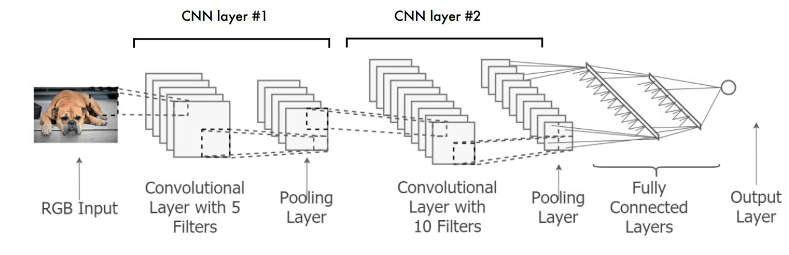

---
### *Now that you told me about CNNs for images, how does this apply to text?*
When we obtain embeddings for the words on a sequence, we can concatenate them into a matrix, simulating a similar case of the images described. Usually we handle filtering a bit differently, as we define the *size of the filter* as follows:
- Width : is equal to the length of the embedding
- Height : is equal to the number of words to look at in the sequence

After filtering, we will apply pooling in a similar fashion as we did for images, following a structure similar to:

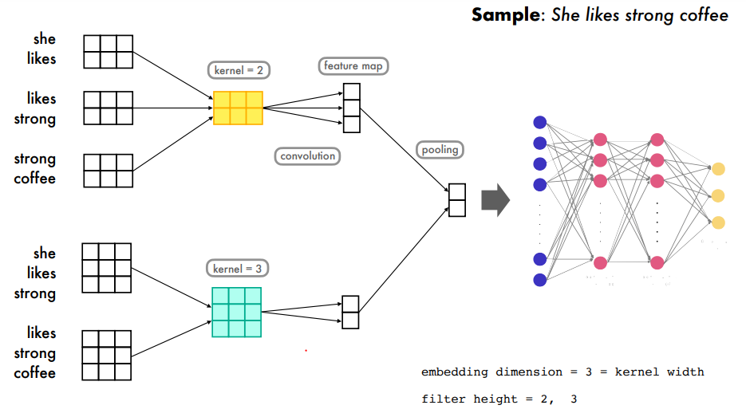

---
### *Okay, makes sense thus far... but you also mentioned Relation Extraction?*
Yes, we consider Relation Extraction (RE) as a task applied *after* Named Entity Recognition (NER), as we are trying to establish relation between entities. In a classical example we might consider RE as divided into two sub-categories:
- **Relation Identification** : We identify that a relation is present between two entities.
- **Relation Classification** : We establish what type of relation is present.

When we evaluate Relation Extraction we might follow three different conventions, following how strict we want to be when we establish a prediction is 'correct'. All include predicting the relation type correctly, but apart from this:
- *strict evaluation* : boundaries of spans as well as entity types are correct
- *boundaries evaluation* : boundaries of spans are correct
- *relaxed evaluation* : >1 token per entity span is correctly typed

For metrics we might consider:
- *macro-F1* : how much the model learn of each class
- *micro-F1* : how the model performs in general

---
---
## PART V - Neural Language Models
Lectures: 9-10

---
### *What is the idea behind Neural Language Models?*
In general, language modelling is about learning a probability distribution over sequences of words. This means, that models will be able to distinguish some sequences as more likely than others, and generate plausible text.

We talked about **Hidden Markov Models** as an N-gram estimate of modelling the entire sequence (i.e. instead of looking at entire history, we estimate history by the n-1 preceding words)
For this we discussed estimating the parameters using a Count-based method, optionally applying smoothing like Kneser-Ney, Witten-Bell or simple Laplace.

When we think of generating sequences of words following the markov assumption estimate, we create a **neural network** for which the input is the embedding vectors of the n-1 words, and we want to predict word n! See below picture for vector / matrix sizes :D

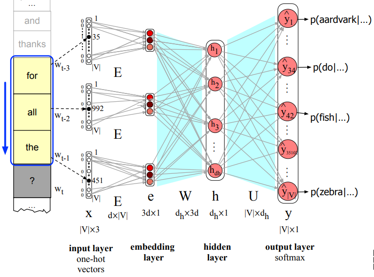

When we train our neural net we use **Cross-Entropy** (*Negative log-likelihood*) as our loss-function. (i.e. minimize L=-log('probability of correct word'))
Weights of the network are updated through *stochastic gradient descent* during the back-propagation step following a forward pass.

---
### *Talk to me about Recurrent Neural Networks*
Recurrent Neural Networks is the first solution we have seen to the problem of needing input to neural nets to be of a fixed size (i.e. markov models / convolutional).
Neural networks are able to take **un-bounded input** without Markov Assumptions or other simplifications like this.

The idea bounds on a simple idea that we know well: looping over the sequence, saving some sort of **current state** and having some function to update the current state based on the item in the sequence. 
The **function** to update the state takes as input the current state and the next item in the sequence. Calculation functions for a single reccurrent step can be seen in below image. Note that the parameters contained in *U* are the same for each recurrent step.
 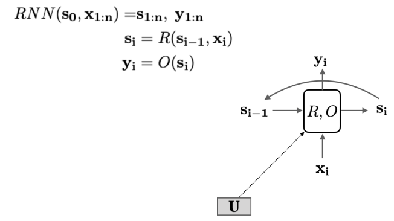

 When **back-propagating**, we should be aware of reccurently backpropagating through the looped history to update but *U*, *V* and *W*.

 Since we are producing an **output state** at each recurrent step, we will need some way of aggregating these;
 - **last state** : we simply take the last state of the row as a sentence encoding.
 - **state aggregate** : for each element we do max or average pooling to obtain a summary sentence encoding.
 - **output as input to NN** : we might use the output of the RNN in a further NN!
 - **loss at every time step** : we might use it for sequence labelling and calculate loss at each timestep and sum these.
 - **As an auto-regressive model** : where the predicted 'next word' is input to the model at the next time-step.

 We might also consider using **Bi-directional RNNs**, for which we do both a forward and backward pass through the sequence. At each position in the sequence, we now have two states (one for each pass)!
 
 Another spin-off are **Stacked RNNs** for which we expand bi-directional RNNs into several layers, using the output states of one layer as input to the next layer.

---
### *Why do I need to worry about vanishing / exploding gradients?*
When we are working with really deep or wide networks, we might encounter a problem commonly known as *vanishing / exploding gradients*. 
The problem appears in back-propagation due to the amount of parameters to tune. (The further back we derive our loss, the less is left)

---
### *Please describe Gated Recurrent Units (GRU)*
Gated RNN architectures are different from 'vanilla' RNNs on two main factors: 
- They have a separate memory, independent of the hidden state
    - Thus, effectively splitting the task of carying on memory of the state and producing local information.
- They control information flow through gates... memory updates are *selective*

In a simplified view of **GRU**, we simply consider whether we want to overwrite the currently saved memory at each time step, only doing it if a value meets some criteria. View below simplified figure for explanation:
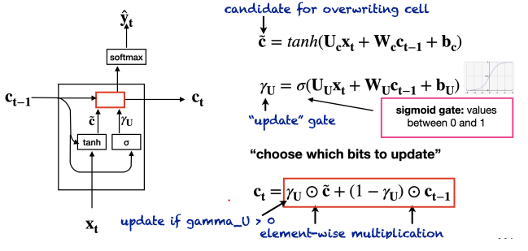

As GRU does not always update the memory *c*, it helps limit the problem of vanishing gradients!

---
### *Please describe Long Short-Term Memory (LSTM)*
LSTM is different from GRU, as it has several different types of gates, namely:
- **forget gate** : what is kept and forgotten from the state
- **input gate** : what new cell content is written to cell
- **output gate** : what part of new cell content is written to hidden state

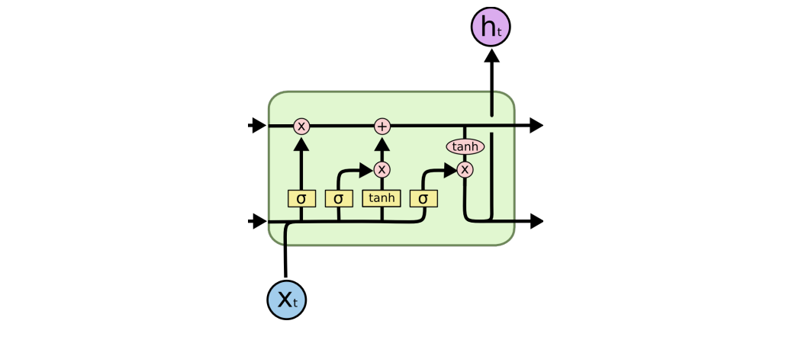
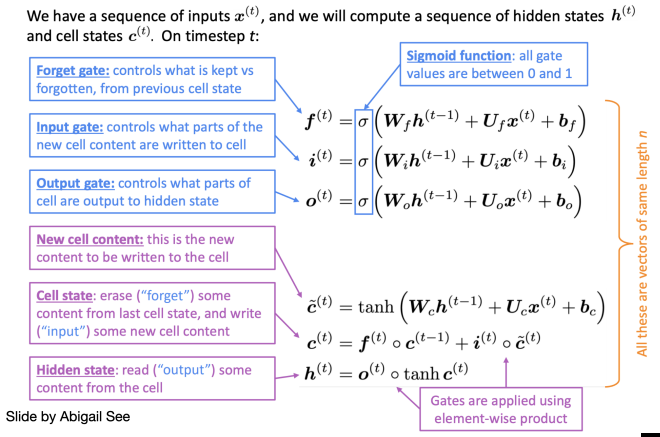

Gates are sigmoid functions that are used in calculations, so they are not solely 'open' or 'closed' but can be open to some degree (0.2, 0.6, 0.9,...)

---
### *Please describe the Attention Model*
So far we have talked about using the last hidden state that was outputted as some kind of estimate of the entirety of a sentence. This is fra from reality, as long-range information is easily lost in the numbers.

The core idea of **Attention** is, that we should find a way to attend to the most relevant hidden states from the sequence.
We do this by creating a **weighted linear sum** of all of the hidden states, with *attention weights*. The attention score is calculated by some function taking the hidden state and a query vector.

---
---
## PART VI - Contextualized Language Models
Lectures: 11-12

---
---
---
# HIGHLIGHTS