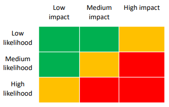
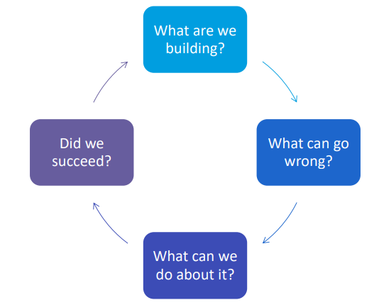
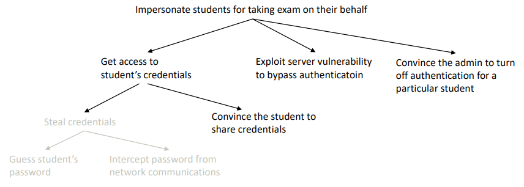
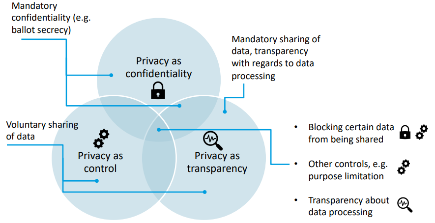
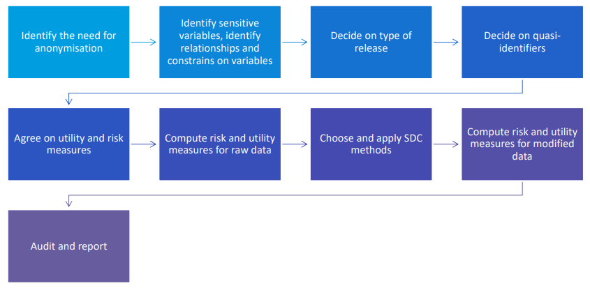
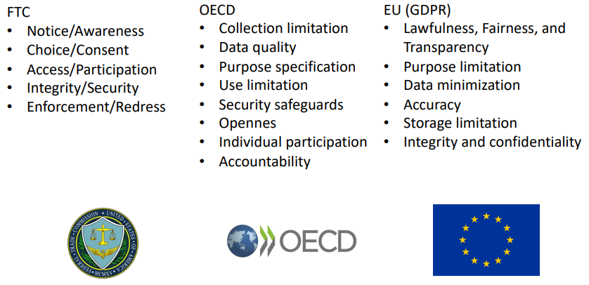
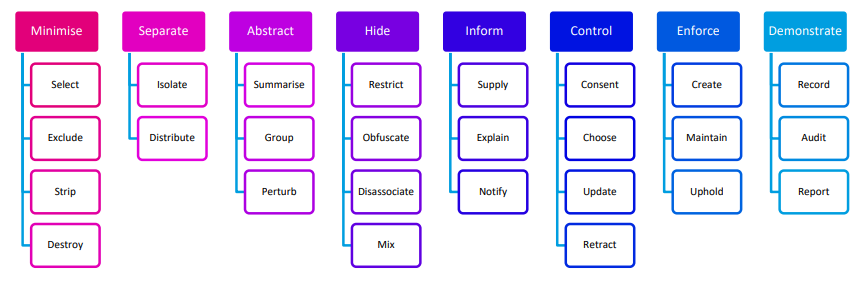
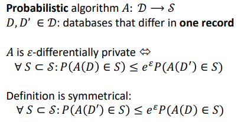
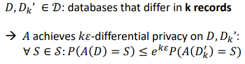
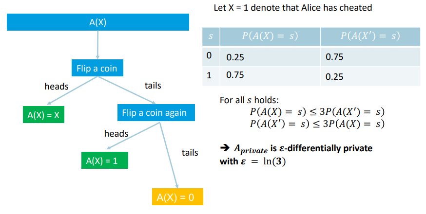

# Security & Privacy - Exam Notes
## Part I - Introduction
### *What do we need security and privacy for?*
The reasons for learning abotu security and privacy is largely two-fold. We learn how to protect ourselves, but also how to protect the data that we work with!

When considering protecting data that we work with we need to consider both storage, analysis and data management in general.

---
### *What are the basic definitions when talking about security and privacy?*
- **Cybersecurity**: "The process of protecting information by preventing, detecting and responding to attacks."
- **Information**: "communication or representation of knowledge such as facts, data or opinions in any medium or form [...], that can be produced, processed or stored by any computer"
- **Attack**: "Any kind of malicious activity that attempts to collect, disrupt, deny, degrade or destroy information system resources or the information itself."

---
### *What different types of attackers might we consider, and what is their motivation?*
#### Interpersonal
Interpersonal attackers target individuals whom they know. They often lack resources and expertise, but are highly motivated in targeting the specific individual. Examples are cyberstalking, cyberbullying and doxxing.

#### Financial / Organised Crime
Mostly non-personal targeting for high-value payouts. Often done by people with some expertise and resources. using fraud, identity theft or ransomware.

#### Hacktivists
Politically motivated attacks - often differing levels of expertise and levels of motivation.

#### State Actors
State-hired attackers with large amounts of ressources and expertise. Often goal is disrupting critical infrastructure to influence the political landscape in a target region.

---
### *What are the basic goals relevant to Security?*
- **Confidentiality**: Any information is kept secret and remains secret even with attackers trying to intercept / access.
- **Integrity**: Any information is truthful and not altered / accessed maliciously.
- **Availability**: Information should be readily available for the scope of a system; Attacks might do DoS,
- **Authenticity**: Users are who they say they are.
- **Accountability**: All actions can be traced to the source for remedial counteractions.

---
### *Why is the attacker-defender relation asymmetrical?*
When we create **security models** we need to think about what we believe an attacker would be able to do, and in this case also discounting protective means under the assumption of what an attacker cannot do. In this way, the defender needs to clsoe off all the ways the attacker might enter the system, while the attacker just ahve to find a single vulnerability and exploit it.

---
### *What can you tell me about risk?*
No system can be 100% secure against any attack, yet a secure system is secure against all plausible attacks. In order to decide what attacks are plausible and that we would like to protect against we use **Risk Estimation**. We might both use any quantitative measer or a qualitative risk matrix approach, yet the problem arises as both are often subject to uncertainty and complexity.

Once we have estimated the risk posed by each identified threat, we might utilize some of the following **Risk Management Strategies**:
- *Mitigate*: We mitigate (lessen) som of the risks, i.e. reduce likelihood and impact. Might be costly in some cases.
- *Accept*: If the impact and likelihood are both small, then we might just accept that the threat exists. It might be too costly to do anything, yet liability issues remain in this case!
- *Avoid*: Avoid having the risk manifest itself in the first place; i.e. worried about data leakage -> do not store any data.
- *Transfer*: Pass the security concerns on to another vendor / person. Thus, the threat will be on their account to be protected.

---
### *Can you name-drop the most important security principles?*
- *Security by Design*: We ensure security is in place throughout development.
- *Fail-safe Defaults*: Default settings should always be the most secure ones.
- *Complete Mediation*: Related to zero-trust, ensure that all accesses to any object is checked.
- *Open Design*: Design can be openly scrutinized and security does not rely on secrecy of protection mechanisms.
- *Least Privilege*: Any user or device should only have the minimal required accesses for their role
- *Defense in depth*: Avoid a single point of failure.
- *Seperation of Responsibility*: Split up privilege so no single person/device has complete power of a process and accesses.

---
## Part I - Security
### *What is all this "adversarial mindset" about?*
Often when designing or developing items or goods, we are mostly interested in what an item/service can do; i.e. we are interested in the *intended* use-functions of an item that solve some problem or challenge that we face. 

Something we forget, is that there might exist a bunch of unintended functionalities that we have not considered, that might pose a threat to security. Think about the example of airtags, and how they might be used to stalk people after slipping it in their belongings. 

The **adversarial mindset** is about thinking the way an attacker would, as to prevent harmful unintended functionalities, such that what we built can not be abused by a possible attacker with malicious intent. This includes considering:
- *Assets*: Things the attacker might want to get ahold of.
- *Capabilities* and *goals*: What do we expect the attacker to be capable of? How should we prioritize?
- *Attack vectors* and *tools*: How do we mitigate the risks? what kind of attacks are we likely to be subject to?

---
### *What is the Cyber Kill Chain?*
The *Kill Chain* is a military concept, which focuses on *advanced persistent threat* models. The main idea is that a threat evolves over several necessary steps, and the defender might break any chain. The main steps of the cyber kill chain are:
- **Reconnaissance**: Collecting information about the target to be used in possible future attacks.
    - There exists both *active* and *passive* recon; i.e. are we actively breaching systems (f.ex. scanning networks) to obtain information, or are we passively intercepting information?
    - We might look up *Common Vulnerabilities and Exposures* (CVE) about identified technologies; These are know faults / leaks in a system that might be exploited.
    - **SQL Injections** is when we use clever tricks, for example a log-in interface utilizing database queries with no projection to ALWAYS let us in by creating a query that returns the necessary value.
    - **Broken Access Control** is when an attacker obtains *privilege escalation* by getting more access than they should have. We might consider several directions of access control:
        - *Vertical*: some users have more rights than other users.
        - *Horizontal*: users have rights to different sections.
    - Open-source intelligence (**OSINT**) is intelligence produced by collectively evaluating and analyzing publicly available information. I.e. it is *passive* and to be used by any individual or corporation. Thus, it might be utilized for both good and bad.
    - One might also use public ressources like krak.dk or tax records, otherwise possibly also leaked data. We need to minimize publicly available sensitive information that might be used for harm!
- **Weaponisation**: Find a way to exploit your entry point of choice!
    - Might be several different methodologies: use a premade exploit, craft an attack yourself, use found credentials to access or plan a *social engineering* attack.
- **Delivery**: Make your exploit reach the intended target. Perform beginning stages needed for the attack.
    - 90% of all cyber attacks begin with an email.
- **Exploitation**: Launch the exploit. We attack!
- **Installation**: Make your presence persistent, such that you can continually exploit the subject.
- **Command** and **Control**: overtake control of all relevant systems and components.
- **Action on objectives**: Steal / Modify / Damage Information!

Many criticise the kill chain for being too high level and not necessarily determining the exact order things would appear in. Alternatives are:
- *Mitre ATT&CK*: 14 tactics and 188 related techniques
- *Unified kill chain*: has 3 high-level stages (in, through, out) and 18 detailed tactics for the stages.

---
### *What is Cryptography and how is it relevant to the Security Goals?*
Cryptography considers everything surrounding algorithms to encrypt and decrypt information. It is highly relevant to 2 out of the 3 security goals: *confidentiality* and *integrity*.

We might consider several different **Cryptographic Failures**, where the cryptography does not fulfill the security goals:
- *Absence* of Cryptography: We simply did not apply it at all.
- *Insecure Algorithms*: Any cryptography that is broken / home-made, as these can easily be broken by an attacker.
- *Insecure Implementation*: Any omissions / insecure storage of keys / insecure parameters that might violate the security of the encryption.

When we look at cryptography we are considering a communication stream between two people Alice and Bob, and the attacker can intercept the communication between these two with the goal of reading or modifying the message.

The **Cryptosystem** is a set of algorithms that can perform:
- **Encryption**: End(message_text, key) -> cipher_text
- **Decryption**: Dec(cipher_text, key') -> message_text
- **Key Generation**: KeyGen() -> key, key'

---
### *What is Symmetric Encryption?*
In symmetric encryption the key used to encrypt the message is the same that is used for decrypting the message. The key is secret and known to the people in communication, but the encryption/decryption mechanisms are public. The main challenge of symmetric encryption is that each person needs to store 1 key per communication channel the use, resulting in way too many keys!

Note that this follows **Kerckhoffs' principle**, which states that the algorithms shall not be secret and it should not be a problem if it falls into enemy hands as long as the key is secret. This allows better scrutiny by researchers, and is related to the *Open design Security Principle*.

Some Examples of symmetric encryption is:
- **Caesar Cipher**: One of the most popularly known ciphers, of which the letters of the alphabet are switched by a certain offset.
    - The main *problem* with this cipher is that there are only 26 possible keys (**small key-space**), and thus it can easily be brute-forced!
- **Substitution Cipher**: Here we place all the letters of the alphabet to be encoded by some random permutation. (similar to caesar, yet it is not in-order)
    - Brute-force is no longer an issue, but **language patterns are preserved**! Thus can often be cracked using neat tricks and frequency analysis.
- **One-time pad**: Use a random n-bit string (0-1) and Encrypt / Decrypt using XOR.
    - c = Enc(m,k) = XOR(m_bit, k_bit)
    - m = Dec(c,k) = XOR(c_bit, k_bit)
    - The main *problems* is the the **key length = message length**, and thus it is not suited for file transfers or longer messages. Also, a **key shall never be reused** as this will reveal information about the key and thus allow us to decrypt the message.. yikes!
- **Block Ciphers**: map fixed-size plaintext into fixed size ciphertext through a variety of techniques achieving *non-linearity*. The initialization vectors are changed to avoid problems of key reuse.
    - DES (Broken) is an example of a block cipher
    - AES (Broken for some modes of operation). AES-CBC (cipher-block-chaining) works. other working: CFB (Cipher Feedback), CTR (Counter)

---
### *What is Asymmentric Encryption?*
Asymmentric encryptions relies on sender and receiver not needing to store the same key, and is largely based on *one-way functions*. 

A one-way function is a function f for which it is easy to calculate f(x) given x, but hard to find x given f(x) = y given y.
Further, a *trapdoor* one-way function is a function with the same characteristics as above, yet following that it becomes easy to find x in f(x) = y given y, in the the case of knowing some secret *d*.

Asymmetric encryption relies on **secret keys** and **public keys** for which *Dec(Enc(m, pk), sk) = m*. 

#### RSA
One prominent example of an asymmetric cryptosystem is RSA. It follows through key generation that the following numbers are generated:
- (s) p is a prime number
- (s) q is a prime number
- (p) N = p*q 
- (p) e is some whole number [1,(p-1)(q-1)-1], fulfilling gcd(e, (p-1)(q-1)) = 1
- (s) d is some whole number same range as e, fulfilling e*d = 1 % (p-1)(q-1)

Now we can define the algorithms for encryption / decryption:
- Enc(pk, message) = m^e % N
- Dec(sk, cipher) = c^d % N 
- Dec(sk, Enc(pk, message)) = (m^e)^d % N = m % N

Note that it is infeasible to find the secret key 'd' given that factoring N for large N is an infeasible problem - this is what ensures the security.

The main **problems** encountered by RSA encryption is when the set of possible m is small: I.e. "Yes"/"No", names from a specific group of people, CPR Numbers.

---
### *What can you tell me about Hash Functions and their utilization for Integrity?*
Hash functions are one-way functions. For somethign to be a good function it needs to follow a set of minimum requirements:
- **Easy to compute** H(m) given m
- **Pre-image resistance**: Given hashed message h, infeasible to find m with h = H(m)
- **Second pre-image resistance**: Given m1, infeasible to find m2 != m1 for which the hashed message is the same: H(m1) = H(m1)
- **Collision Resistance**: Infeasible to find H(m1) = H(m1) for which m1 != m2

In theory the advantages of using hash functions is that an attacker does not learn any passwords even if database is leaked. BUT! For *known passwords* it is easily reversible, And users with the *same password are easily detectable*.

#### Salt and Pepper
Instead of just hashing f.ex. passwords directly, one might use the salt and pepper method. Here we append the password with salt and pepper, of which salt is a random string connected to the username instance and pepper is a random secret global string used across all passwords.

#### Digital Signatures
Builds upon the idea of asymmetric encryption, using algorithms:
- Sign(message, sk) -> signed: can only be produced by the sender using their secret key
- Verify(message, signed, pk) -> TRUE/FALSE: Verifies that message and signed have been produced using the secret key associated with a given public key.

---
### *Tell me a bit about Authentication*
There are three different levels at which we might consider verifying a user trying to access a resource:
- *Identification*: "This is Alice"
- *Authentication*: "This person who claims to be Alice is actually Alice"
- *Authorisation*: "Alice has rights to access the resource"

When we talk about **Authentication** in Particular, we might consider three main groups of authentication methods, and whenever we combine several of these methods we obtain *multi-factor authentication*:
- Something you **know**: passwords
    - Can be brute forced :( also, hard to remember a lot of long strong passwords by heart, thus not very suited for the human brain!
        - *Guessing* attacks: Brute-force, phishing, password recovery security questions
        - *Snooping* attacks: (User-side) Spywareon device (keylogger) of physical space (PW written down)
        - *Sniffing* attacks: (communication-side) attacker observes network communication - USE HTTPS / VPNs!
        - *Server Breach* attacks: attacker gets access to the server doing authentication, thus getting access to all incoming communication.
    - Single Sign-On (SSO): use a single account / identity to authenticate to other services. Does pose potential privacy concerns and poses a *single point of failure*.
    - Secure Shell Protocol (SHH): Harder for the user, requires knowledge of using public and private keys and keeping the private key completely secure.
- Something you **have**: keycard, USB, smartphone
    - Can be stolen / lost and might be forged if not enough safe guards exist (often part of multi-factor)
- Something you **are**: fingerprint, face ID, voice
    - Inherence-based: can be physiological (iris, fingerprint, blood pressure) or behavioral (signature, voice)
    - Often more error-prone (false positives and negatives) - can be spoofed! Also, problematic as these are not "replaceable" in same way as a password or key-card might be!
    - Requires sampling of key features to create a template that best approximates those features.

---
### *What about Access Control?*
When we combine *Authentication* and *Authorisation* we end with **Access Control**. We might define the allowed accesses on various granularities considering:
- *Discretionary Access Control*: For each user and each resource access rights are defined: very granular, but lacks flexibility!
- *Mandatory Access Control*: Access rights are defined based on a vertical security clearance. Anythign on or below your clearance is visible to you. (Military way)
- *Role-Based Access Control*: Access Rights are associated to each role, and people can be assigned these roles to gain access to relevant resources.
- *Attribute-based Access Control*: Access rights are determined based both on the subject, object and environment; i.e. does this individual who is X need access to Y for which Z and W are true? Very fine-grained!

---
### *What is threat modelling?*
Threat modelling is a general class of approaches towards security management, and can be used to model and prioritize different threats. the main questions we consider are cyclical as depicted below:

#### What are we building?
In this stage we attempt to describe the entire functionality of the system we want to do threat modelling for. This includes describing all:
- **Functionality**: How is the system used?
- **Acces Rights**: Who should be able to do what in the system? (users and trust levels)
- **Assets**: Which entities are held within the system, that might be of value?
- **Data Flow**: What communication paths does the data flow consist of?

#### What can go wrong?
In this stage we are interested in coming up with all possible attacks using brainstorming. The most common guided way of brainstorming is **STRIDE**, applied to the system as a whole or individual components:
- **S***poofing*: Violating authenticity by impersonating a user/process/component.
- **T***ampering*: Violating integrity by maliciously altering data
- **R***epudiation*: Violation non-repudiation by denying an action took place (f.ex. student denying taking an exam)
- **I***nformation disclosure*: Violating confidentiality by accessing information without being authorised.
- **D***enial of service*: Violating availability by preventing access to services / data.
- **E***levation of privilege*: User getting access privileges higher than allowed to their role. (Vertical: more rights, horisontal: different rights)

Then one might create an attack tree and use pruning to eliminate threats defined in different branches due to safety measures:

#### What can we do about it?
At this step we use the **Risk Management** strategies as described elsewhere to model the likelihood of each threat and move threats into a manegable likelihood and impact.

#### Did we suceed?
Who knows? lets start over!

---
## Part II - Privacy
### *Tell me about the Privacy Paradigms and their relevance to privacy concerns*
Privacy is concerned with the protection of personal data in any and all cases, from processing to storage or analysis and more. We might consider three privacy paradigms as being integrate parts of these concerns:
- **Confidentiality**: Protecting information against unwanted disclosure.
    - Overlaps with security of data, as it is often about protection against attacks and non-authorised access.
    - Might also concern derivation based on open data, for which it is an issue for privacy-preserving data analysis.
- **Control**: Providing control over sharing one's data.
    - Both concerning what data is shared and with whom, but also about purpose and further sharing.
- **Transparency**: Providing transparency of data processing.
    - User: information about the data shared, consequences and assurance of honoring controls provided.
    - Authorities/Society: Being a trustworthy entity, open about how data is used, stored and processed.

It should be noted that the different paradigms apply to certain contexts. Below is an overview of how some privacy related data fits into the paradigms:

---
### *Which Disclosure threats might be relevant to discuss for confidentiality?*
A disclosure threat is related to a scenario for which private data is transferred, stored or processed. Consider the following scenarios:
- **Trusted Curator**: You participate in a research survey, and thus transfer sensitive data to a trusted institution. The *threat* is data leakage! The following steps should further be considered:
    - Encryption of the communication.
    - Given Research Institution publishes data, we should consider that an individual might be identified by other attributes than just their name.

#### Types of data
When talking about disclosure threats it is very important to consider the different types of data, especially in research with publishing of open data:
- **Sensitive non-identifyinf data**: The sensitive information about a person that an attacker might want to learn.
- **Direct Identifiers**: Identifiers that are directly associated to an individual: name, social security no., fingerprint
- **Quasi-identifiers / key variables**: Information about an individual that does not identify them in and of itself, yet in combination might reveal the identity of an individual.

Further we might consider different types of data release:
- Microdata (Raw data record, with each line representing an individual)
- Tabular Data (Overview (Summary) statistics about number of people in the dataset havign a certain attribute value)
- Query-based (Where one is able to get the results from an SQL-query or similar from the database)

#### Types of disclosure
There are different types of disclosure that we might wish to prevent, as they pose different types of threats to the data subjects / individuals.
- **Identity Disclosure**: Identify an individual in a set of respondents. I.e. i figure out that this data record, is related to this real person Alice.
- **Attribute Disclosure**: Learn previously unknown information about a person. I know this person is in the dataset, can i learn which disease they have? OR this un-identified individual has cancer.
- **Membership Disclosure**: Identify whether a person is in the dataset. (A variant of attribute disclosure) Learn whether a person is present in the survey data or not.
- **Inferential Disclosure**: Learn information about a person from data from others. I.e. study shows smokers are likely to have cancer -> Alice smokes -> Alice likely has cancer. *Not addressed by disclosure control*.

---
### *Which measures should i be aware of to avoid an adversarial performing succesful record linkage?*
Record linkage happens when an attacker has some data about people and link records containing sensitive data to the data they have, effectively learning sensitive information about individuals.
- **Sample Uniques**: Consider how many sample uniques are in the dataset considering different quasi-identifiers. Often Age / DoB will be the source of many sample uniques.
- **Sample Frequency**: *x.f*: How many records within the sample have the same quasi-identifiers? Mimics the situation when an attacker knows whether a record is in the sample.
- **Population Frequency**: *x.F*: How many records within the global population have the same quasi-identifiers? Mimics the attacker having no additional knowledge about membership, but only access to public records.
- **Re-identification Risk**: *r*: risk of re-identification given population data: 1/x.F

#### Record Linkage with noise addition
If we add noise to a quasi-identifier, it becomes harder to match directly. Often uses Distance-based matching; which record has the closest ressemblance?

Mistakes are very possible, as records can in principle match several different people due to the noise, and we would not know which is correct. 
It is possible with other heuristics, like only considering something a match if the 'second-best' match is not too close, creating a better insurance of a guess being correct.

---
### *Why is protection against disclosure so hard?*
One of the main challenges in disclosure control is the **presence of external data** as it can be hard to establish exactly what information about an individual is present in the public domain. This might both be public registers / address books and unofficial/self-disclosed data, like social media posts or posts by others.

Another challenge is **high-dimensionality**, as we often have a lot of data connected to each individual record. This inevitably creates a higher number of population uniques as more quasi-identifiers are present! We are basically trying to find the right balance between *Utility* and *Privacy*, as it is a **trade-of** we have to consider. Some disclosure is inevitable, as the most private data is NO DATA.

---
### *Can you introduce me to disclosure control methods?*
Disclosure control is about leaking some data while preventing too much leaking - i.e. we want to share some data, but we do not want to reveal it in a privacy-preserving manner. Here is an overview of different methodologies:
- **Removing Direct Identifiers**: Most obviously, we do not want any direct identifiers present in our dataset. 
    - We might do this in a variant of Pseudonymisation, where we encrypts or replace direct identifiers with IDs. 
    - We should consider that hashing the name will still pose a threat, as membership and other disclosures can be found if we know the name(s) and hash function used.
- **Non-perturbative**: Preserving the truthfulness of individual records.
    - *Generalisation / Recoding*: We replace data with a more generalised / grouped version: F.ex. DoB -> Age -> Age Group
        - Remember top- adn bottom-coding to avoid edge case sample uniques.
    - *Suppression*: We simply remove data (entire column or single record attribute using '*')
- **perturbative**: Distorting the data, yet preserving aggregate data analysis results.
    - *Noise Addition*: We add noise to the data, but should be aware of hiding outliers!
        - Uncorrelated noise: preserves mean and covariance, noise from a continuous normal distribution.
    - *Post-Randomisation Method* (PRAM): Based on a pre-defined transformation matrix, replace categorical variables by some probability distribution. 
        - I.e. some % chance of flipping the answer or keeping the answer truthful.
    - *Swapping*: Swap values of an attribute between records. 
        - Danger of losing correlation: consider within-group swapping based on some condition.
    - *Synthetic Data*: Produce a dataset with fake data, generated to a pre-defined model based on real data.
        - Very difficult to do, and inefficient!

We always need to consider the utility of the data, after apploying anonymisation techniques; We might for example consider:
- Number of modifications
- Counts, mean, covariance kept similar
- Statistics specific to the research question kept
- Other information loss metrics

Below here can be seen an overview of the entire disclosure control process:

---
### *What risk-measures are relevant to consider when working with disclosure control?*
Whenever we apply disclosure control methods we area attempting to minimize both the **average risk** and **maximum risk** for individuals in our sample, and possibly also the **percentage of records above some risk level**.
All of these measures tells us something about the risk posed for individuals in our samples, and minimizing them is in the interest of our trustworthyness and their safety / privacy.

When we apply disclosure control methods we might specifically ask for a certain level of privacy, depending on the nature of the data. Possible options for describing level of anonymity are:
- **k-anonymity**: Ensure that *sample* frequency (*x.f*) is at least k for all records. Thereby also ensures that the individual risk is always *x.r <= 1/k*.
- **l-diversity**: Ensure that for any set of samples wiht the same quasi-identifiers, there are at least l different values of the sensitive variable.

Given that we are in a case where we have applied perturbative methods to some attributes, a possible attaker would use *distance-based record linkage*, and in these cases we need to model our risk based on this approach.
Thus, as the data processor we mimic the record linkage and review how many records are re-identified correctly.

---
### *Which Privacy Principles should i be aware of?*
Many governing bodies issue privacy principles to be followed by any entity processing or storing data on real persons. These cover all the paradigms (confidentiality, control and transparency):

---
### *What are the main ideas behind Privacy by Design?*
Privacy by Design is a holistic concept and not a specific set of rules/guidelines. It is there to address all three paradigms and can be used in the design of strategies and guidelines for different contexts, including legislature.
The Privacy by Design principles contain:
- **Proactive not reactive**: There should be a focus on preventing privacy violation as opposed to taking remedial action. Privacy harms cannot be undone!
- **Privacy as the default**: The default options of any system should be the most privacy-preserving ones. Privacy control is a complicated topic, and users won't change anything if they don't NEED to.
- **Privacy embedded in the design**: Implement privacy protection from the beginning of the design. Keeps the upper hand, and avoids expensive fixer-uppers later!
- **Full functionality**: functionality of system should not be dependent on sharing of personal data / violating privacy.
- **End-to-end security**: secure the data in all stages of its lifecycle: in-transit, storage, processing, deletion.
- **Visibility and Transparency**: It should be transparent to users and authorities what data is collected and how it is used and stored.
- **Respect for user's privacy**: Always put the interests of the user in mind, ensure consent and access in a user-friendly manner.

---
### *What Privacy Engineering methodologies exist other than Privacy by Design?*
- **Privacy Threat Modelling**: Similar to threat modelling practices described earlier, but focusing on privacy concerns. LINDDUN is a framework for threat-brainstorming, but there exists many others!
    - Read more detailed LINDDUN run-through below.
- **Privacy Design Strategies**: A number of goals to work towards in the design of systems.
    - 
    - **Minimise**: Ensure that only data you need is collected and stored.
        - *Minimise Collection*: Select (What do i NEED), Exclude (What do i NOT need)
        - *Minimise Storage*: Strip (Remove *attribute* when no longer relevant), Destroy (unnecessary data *destroyed* entirely)
    - **Separate**: minimise disclosure risks from aggregate statistics.
        - Isolate (Collect data in different databases), Distribute (avoid centralization by relying on client-side software)
    - **Abstract**: Get rid of unnecessary details
        - Summarise (generalisation / recoding of attributes), Group (report data on groups instead of individuals), Perturb (modify data)
    - **Hide**: prevent unwanted access to the collected data.
        - *Preventing Access*: Restrict (Least privilege, can only be accessed if required), Obfuscate (Can only be read by authorised parties)
        - *Unlinking*: Disassociate (direct identifiers should be stored unlinked to the rest of the data), Mix (Data shuffling to prevent linkage of individual records)
    - **Inform**: Ensure user is aware of processing/collection practices
        - Supply (provide information to user), Explain (ensure user understands information), Notify (ensure user is aware when data is collected)
    - **Control**: provide user with control over their data.
        - Consent (User should give explicit consent and possibility to withdraw), Choose (control over which data is shared and purpose limitation), Update (user should be able to review and change settings), Retract (user should be able to withdraw consent)
    - **Enforce**: ensure that privacy protection measures are implemented.
        - Create (develop and commit to privacy policies), Maintain (ensure following policies by implementation and education), Uphold (Review and update policies when necessary)
    - **Demonstrate**: Demonstrate adherence to privacy protection.
        - Record (keep track of steps taken, decisions and observations), Audit (audit logs and processes), Report (report steps taken and sudit results to authorities / public)

#### LINDDUN
LINDDUN is a threat-modelling framework for privacy concerns and contains the following steps:
- **Linking**: Learning information about individuals / groups from disclosed data.
- **Identifying**: Learning the identity of an individual / data subject from a disclosed dataset (identity disclosure threat)
- **Non-Repudiation**: Making plausible deniability impossible, I can provably demonstrate a certain action done by an individual.
- **Detecting**: Being able to detect that a certain action heppened, but not necessarily further contents. Yet, here plausible deniability might still remain.
- **Data Disclosure**: Collecting excessive amounts of data (i.e. not following Data Minimization).
- **Unawareness/Unintervenability**: Not providing sufficient transparency and/or control to the end users.
- **Non-compliance**: Not ensuring compliance to all relevant regulation and standards.

## Part III - Differential Privacy
### *What is Differential Privacy?*
So far we have talked about statistical disclosure control methods. These often make assumptions about attacker knowledge, and calculates risk based on our current world picture. 
Even for perturbative methods it is hard to estimate whether to advice on anonymisation parameters or not, as the trade-off between risk and utility is hard to estimate.

Differential privacy makes **no assumptions** on adversarial knowledge and sensitivity of the information, it has **mathematically provable guarantees**, and **reporting parameters** does not compromise the privacy of the individuals. Further, it is **better protected** agaisnt future attacks or data releases, as there exists no leakage / a bounded leakage.

The slogan is:

*One should not learn anything new about Alice from the output, that one couldn't also learn from the output, if Alice weren't in the database*

I.e. we allow *inferential disclosure* but prevent any other kind of disclosure from happening. It should be noted that these are harsh requirements, as they should hold for **every S** and for **all neighboring D & D'**.

#### The two worlds
We might consider two different worlds / datasets:
- D: dataset containing Alice
- D': same dataset, but without Alice

The goal of differential privacy is to ensure that an analysis output A(D) and A(D') are practically *indistinguishable*!

#### Parameters and formal definition

$\epsilon$ is the privacy parameter, and we might state that a specific Analysis function *A is $\epsilon$-differentially private*. It is a measure of the disclosure level. It follows that:
- Large $\epsilon$ -> more disclosure
- Small $\epsilon$ -> minor disclosure
- Research suggests 0 < $\epsilon$ < 1
- Remember that high privacy is a trade-off for low utility

We might further introduce $\delta$ for allowing full disclosure in some rare cases. We give $\delta$ = 0 for no tolerance, and $\delta$ > 0 for some tolerance.

#### Group Differential Privacy
We might consider the impact on the dataset when removing a group of people instead of a single person (i.e. a household or similar), this is called Group Differential Privacy.
Here we define the algorithms slightly differently:

#### Challenges of Differential Privacy
There are many notable challenges associated with differential privacy, including:
- End users not knowing risks/benefits of sharing one's data
- Statistical agencies not being able to apply differentially private algorithms
- Data Analysts not knowing how to account for errors introduced på differentially private algorithms
- No protection against inferential disclosure
- Inconsistencies in data!
- Complex and high-dimensional data is still a huge challenge for differential privacy!

---
### *What are some differentially private algortihms?*
There exists a variety of differentially private algorithms that we might consider. One of the most prominent examples is the **Laplace Mechanism**.

#### Laplace Mechanism
Based on the idea idea of adding some random noise X (real number) to the query output. Specifically, we sample the noise X from a Laplace distribution with parameters $m$ (Mean) & $b$ (Variance is $2*b^2$):

$$f(x|m,b) = \frac{1}{2*b} * e^{\frac{-|x-m|}{b}}$$

For and $\epsilon$-differentially private algortihm we need to add noise $X \sim Laplace(0, \frac{1}{\epsilon})$

#### Randomised Response
The idea is to submit a randomised answer, such that each individual participant has plausible deniability!

It should be noted that the following holds in terms of an $\epsilon$-differentially private algorithm A:
- $A(X)=X_{random} with p=\frac{1}{1+e^\epsilon}$
- $A(X)=X_{real} with p=1-\frac{1}{1+e^\epsilon}$

#### Privacy Budget
Privacy loss is quantified via a **privacy budget**, because if we could run the same query 100 times, we would be able to estimate the most likely query result...

Therefore we need to consider implications of how different combinations of differentialy private algorithm outputs impact the overall privacy guarantees! **NOTE**: If there MIGHT be an overlap, we do sequential. Only if we KNOW they are disjoint, it will be parallel :)
- **Sequential Composition**: Given two queries where Alice is present (**overlapping**), the privacy budget of $A_1$ and $A_2$ is $\epsilon_{total} = \epsilon_1 + \epsilon_2$
- **Parallel Composition**: Given two queries of **disjoint** sets of the data, the privacy budget of $A_1$ and $A_2$ is $\epsilon_{total} = max(\epsilon_1 , \epsilon_2)$
- **Post-processing**: It does not impact our privacy guarantees, when we apply any transformations / processing afterwards.

---
### *What is the global sensitivity in relation to differential privacy numerical queries?*
**Global sensitivity** describes the "maximum risk" (maximum difference) associated with a single set of datasets D and D'. Here are a few examples of global sensitivity:
- Counting Queries: 1
- Sum over attribute x: max(x)
    - Rating from 0-5: 5
    - Age: not strictly, but 125 is the oldest known person alive

When we then consider **Differential Privacy**, we need to consider that a single record will make a difference of up to the *global sensitivity*. This means that the **noise** should be $X \sim Laplace(0,global\_ sensitivity)$

## Part IV - Human Factors
### *Why is it relevant to discuss human factors in security and privacy?*
W might have an expectation that users take care of their security an privacy, but in reality users are often not motivated or not capable of doing so... We might consider this as a **privacy paradox** as users care about their privacy (surveys show this), yet they do not utilize privacy-enhancing tools or pay attention to policies and notices.

A good example of the mismatch between system designer's expectation and user behavior is *passwords*. Passwords are common and relatively low-cost authenticationg tool. A system designer will assume that users:
- Select strong passwords
- Manage passwords securely

Yet, in reality passwords are often easier to guess and obtain; Default password not changed, Phishing to obtain credentials etc.

---
### *What are the different factors that might impact how we make decisions as users?*
- **Risk**: What are the consequences if i dont act?
    - Might be underestimated due to a certain world-view: "only large companies get hacked" and "I have nothing to hide"
- **Efficacy**: Will the risks be less if i choose to act?
    - Might misunderstand effectiveness of some action: "there is nothing one can do anyway" and "I don't understand technology anyway"
- **Cost**: cost of acting.
    - Monetary Costs of security controls
    - Time required
    - Mental effort required
    - Loss of functionality (by refusing to hand over personal data and similar)
- **Norms**: How will other people think about whether i act or dont act?
- **Attitude**: How do I personally feel about whether i act or dont act?

#### The task-oriented user
Often users are highly task-oriented, meaning they are largely focusing on the task at hand. This means that they are focused solely on the main goal of the task, f.ex. accessing an email account.
Yet, in reality a lot of tasks come in between; i.e. remembering a password, entering the password, possibly multi-factor authentication. Thus we distinguish between:
- **Primary Tasks**: The task the user actually want to do
- **Enabling Tasks**: The tasks the user has to complete in order to do the primary task. Most security / privacy tasks fall within this category.
    - Often perceived as annoying, boring and as a *non-efficient* use of time.
    - Often users will try to avoid or have work-arounds to avoid "wasting time" on enabling tasks.

---
### *What biases should we be aware of when considering human factors?*
- *Availability heuristic*: 
    - "I haven't heard about it recently, so it is not relevant."
    - all relevant things are brought up frequently.
- *Anchoring / Framing*: 
    - "My friends share everything on Facebook, so it is ok"
    - other people do it, so it is not problematic.
- *Optimism bias*: 
    - "Bad things cannot happen to me"
    - refusing to take care because it deems unrealistic.
- *Hyperbolic discounting*: 
    - "immediate gains are more important then possible consequences in the future" 
    - we care more about what we get out of it now than what happens in the future.
- *Status-quo bias*: 
    - "This is the default option, so it must be the best one"
    - believing defaults are always the best

---
### *Which mental capabilities are important to keep in mind when designing for security and privacy?*
- **Signal Detection**: People are only able to pay attention to one main task at a time. Weak signals should be avoided!
    - *Habituation effect* / *Alarm fatique*: too many false alarm makes the user neglect warnings as unreliable.
- **Memory Constraint**: People are only able to remember a certain number of things at any time.
    - *Short-term*: strings < 6 digits
    - *Long-term*: hard to remember many similar items.
- **Predictability**: humans a predictable in their choice of passwords and patterns, as it is often common to have easy-to-remember passwords and predictable substitutions.

---
### *Which structural challenges are relevant in terms of human factors?*
- **Complexity of Information**: Service providers keep controls complicated and complex -> it is hard and time-consuming for the user to be aware of all risks and consequences!
- **Complexity of risk estimation**: Users often underestimate risks, yet in general it is just hard to estimate risk! Consider the metaphor "death by a thousand paper cuts" in terms of sharing small amounts of data many times!
- **Inference from others**: Users are highly impacted by other users' choices, thus it becomes hard to protect ones' privacy by individual choice only.

---
### *How do we account for human factors in our systems?*
- **Make Systems Usable**: Users should be able to obtain the desired output *effectively* (accurately and completeness), *efficiently* (with minimal resource expenditure) and *satisfactory* (wiht comfort and acceptability of use)
- **Make it harder to fail**: Reduce human error by making choices on behalf of the user (blocking, changing authentication channelse) and make security and privacy the default!
- **Educate the user**: Make users aware of consequences on different levels: *awareness* (alerting people), *education* (informing abotu risks) or *training* (concrete skills for protection)
- **Practice Responsible Data Handling**: Data processors need to take responsibility, as users are not always educated enough to make the decision that suits them best! Ethical concerns should lie with the collector.
- **Privacy as contextual integrity**: Privacy as determined by contextual norms of information flow. A unifying network for other paradigms / definition, as it considers all data in a certain context and scenario.
- **Involve the user in the development process**: Human-centered security by design ensures that the system is designed as user-friendly as possible with human factors and feedback in mind!

## Part V - Legal Aspects
### *What is GDPR, and how does it relate to security and privacy?*
GDPR (**G**eneral **D**ata **P**rotection **R**egulation) are fundamental rights for individuals located in EU.
It is important to consider what data and which types of data you both collect and store, to realise which laws and regulations apply to your data processing. GDPR is specifically concerned with **personal data**, and you should remember that not all data is personal!

A fundamental principle is also that data subjects should be informed by the controller in a manner that is concise (brief yet comprehensive) transparent (easy to perceive) and intelligible (comprehensible).

Applies to personal data of any **data subject who is in EU**.

#### Charter of Fundamental Rights of the European Union (2012)
Describes the fundamental rights of individual within EU, and has two articles of interest: 
- Article 7: Respect for private and family life
    - Everyone has the right to respect for his or her private and family life, home and communications. 
- Article 8: Protection of personal data
    - Everyone has the right to the protection of personal data concerning him or her.
    - Such data must be processed *fairly* for *specified purposes* and on the basis of the consent of the person concerned *or some other legitimate basis laid down by law*. Everyone has the right of access to data which has been collected concerning him or her, and the right to have it rectified.
    - Compliance with these rules shall be subject to control by an independent authority.

#### Anti-money Laundering
It is complicated to use personal data, as some laws are contradictory; i.e. the AML-directive contradicts privacy protection, as it states:
- the information on the beneficial ownership of companies incorporated within the territory of the Member States is accessible in all cases to *any member of the general public*

Yet this was found by courts to be invalid, and should be limited to strictly necessary purposes, as opposed to "in all cases to any member of the general public".

### *What is Legal Basis in terms of GDPR?*
Legal basis is the interpretation of other laws an regulations to create "*legitimate basis laid down by law*" for processing personal data without consent needed. 
These should always be **interpreted restrictively**, yet **sensitive data** always takes precedent over any legal basis you might find. This means that if you collect even a single item of sensitive data, the whole dataset should be considered and treated as sensitive.

Legal basis takes three forms:
- **Consent**
    - Needs to be *freely given*, *specific*, *informed* and *unambiguous indication*. I.e. should be a *statement* or *clear affirmative action*!
    - Must contain the controller's identity, purpose of proessing and inform about rights to withdrawal. 
- **Performance of a contract**
    - Should follow *reasonable expectations* of the data subjects based on *their relationship* with the controller (i.e. services related to the personal data or similar)
    - The interests / expectations of a data subject may be *overridden* when processing is strictly necessary for the purposes of *preventing fraud*!
- **Compliance with a legal obligation**

---
### *Who are the key players and the main principles within GDPR?*
It is important to consider who is intertwined within the processing of personal data, as well as the main points of the regulation thaty we should be aware of. Here we go:

#### Key Players
- **Data Subjects**: The subjects whom the personal data you have collected is about. **Personal Data** means any information relating to an *identified* or *identifiable* natural person.
- **Controller**: The person / entitiy conducting and responsible for collection and/or storage of personal data.
- **Processor**: A third-party vendor doing work *on behalf of* the controller.

#### Main Principles to comply with
- **Lawfulness, fairness and transparency**: Considering how we should handle collection, storage and processing of personal data.
    - *Controller* should act in relation to *data subjects* in a lawful, fair and transparent manner!
- **Purpose limitation**: Considering how we should ensure to li'mit our purposes to only a specific and defined use case.
    - *Controller* collects data for a **specified**, **explicit** and **legitimate** purpose(s), and does not process or collect data in ways incompatible with these.
- **Data minimization**: Considering how we should go about determining what data should be collected and kept.
    - *Controller* shall minimize data to only what is **necessary**, **adequate**, **relevant** and **limited** for the purpose!
- **Accuracy**: Considering how accurate the collected data is.
    - *Controller* shall keep the personal data up-tp-date, and take *every reasonable* step to ensure that inaccurate personal data are **erased** or **rectified** *without delay*.
- **Storage Limitations**: Considering both how long and how much data should be stored.
    - *Controller* must not keep personal data from which data subjects can be identified for longer than *necessary*.
- **Integrity and Confidentiality**: Ensuring proper mechanisms for protection and integrity of the data.
    - *Controller **and** processor* processing in a manner that ensures apropriate *security* of personal data, including protection against:
    - **unauthorised** or **unlawful** processing and **accidental** *loss*, *destruction* or *damage*

#### Data Types
- **Genetic Data**: Personal Data relating to inherited or acquired genetic characteristics.
- **Biometric Data**: Personal Data from technical processing of physical, physio logical or behavioral characteristics of a person.
- **Health Data**: Personal Data related to the physical or mental health of a natural person.

### *Tell me about the rights of data subjects relied in GDPR*
An individual has a number of rights under GDPR when concerned with their personal data, which includes:
- **The right to be informed**: Exercised by the controller in properly informing the data subject about purpose and scope of any data collection *at the time when personal data is obtained*.
- **The right to access and rectification**: Exercised by the data subject, to obtain information about the purpose, categories of personal data and recipients whom it will be disclosed to. Further also retention period and additional rights.
- **The right to object**: Exercised by the data subject to oppose any processing / further processing of their personal data.
- **The right to erasure**: Exercised by the data subject, yet only applies for specific applications.
    - When personal data is no longer required for the purpose provided upon collection.
    - Upon withdrawal of consent given no other legal basis.
    - Upon objection to processing, given that there exists no overriding legitimate interests.
    - When data must be erased in order to comply with a legal obligation.
- **the right to data portability**: Exercised by the data subject to obtain all data concerning them in a structured, commonly used machine-readable format.
    - You have the right to obtain a copy of your own data, yet this cannot affect rights of other people, thus on video, photos and other files other people need be deleted prior to providing the copy.