# Software Development & Software Engineering - Exam Notes
## Part I - Java for Data Science & Object-Oriented Programming

### *Why do I need Java as a Data Scientist?*
When working as a data scientist, it is best to have knowledge of a compbination of Python, R, SQL and Java... Because Java is: 
- more general-purpose and
- creates faster running programs. 

Java fails when it comes to visualizations and statistical analysis, but we know how to do these in Python / R. We have many nice libraries for data science in python and R, but whenever we work with very large amounts of data, we should consider switching to a better performing programming language.

---
### *What is Structured Programming (& OOP)?*
Structured Programming uses different motions to get rid of repeated code, by creating functions for frequently used code sequences.
Often a key in structured programming is also to divide the overall structure into the data (variables) and the actions on data (functions).

When we then consider **Object-Oriented Programming** we go one step further, and contain that data and actions on the data within a class. Thus, everything concerning some data will be kept in an enclosed space in a specific format. In smart terminology, we obtain *Abstraction*, *Encapsulation*, *Inheritance* & *Polymorphism*.
- **Inheritance**: Commonalities between classes are out in a generalized super class and inherited to subclasses to de-duplicate code.
- **Encepsulation**: Visibility modifiers are used to decide who can access each bit of a class (attributes/methods).
- **Polymorphism**: Whenever a general class is expected, any specialization can also be passed.
- **Abstraction**:  

---
### *Show me the 'Elementary Java Language Constructs'*
What to remember as different from python:
- All things should be declared with a **type**, i.e. variables, returns of functions and so on!
- All statements should be terminated with **;**
#### Primitive Types:
- *boolean*: <code>true</code> or <code>false</code>
- *char*: <code>'a'</code>
- Whole Numbers:
    - *byte*:           - between -128 and 127
    - *short*:          - between -32.768 and 32.767
    - *int*: <code>12345</code>      - between -2.146.483.648 and 2.147.483.647
    - *long*: <code>12345L</code>    - between -9.223.372.036.854.775.808 and 9.223.372.036.854.775.807
- Decimal Numbers:
    - *float*: <code>1.45f</code>            - 6-7 decimal places
    - *double*: <code>1.45</code> OR <code>1.45d</code>   - 15 decimal places

#### Non-Primitive Types:
- *String*:<code>"Hello!"</code> - Character Sequences
- *enum*: <code>{cat, dog, parrot}</code> - User-defined, own type
- *array*: <code>int[10]</code> - Multiple values of same type (fixed length)
- Collections: <code>List\<Car> allCars = new ArrayList\<Car>();</code>
    - *List<?>*: Multiple values of same type (dynamic length)
    - *Map<?,?>*: Relation between pairs
- Classes: User-defined with attributes and methods.

#### Control Flow Concepts
Conditional Control Flow Branching evaluates a boolean / boolean expression to determine what to execute and the number of times to execute. Loops are code repeated a number of times, depending on some condition / count.
 
```java
// If-Statement based on condition
if (condition) {
    // Something happens
} else {
    // Something happens
}

// While-loop based on condition
while (condition) {
    // Something happens
    // Modify condition / vars
}

// For-loop (below example executes 10 times, as follows condition)
for (int i = 0; i < 10; i++) {
    // Something happens
}

// For-loop (looping through collection)
for (Car car : allCars) {
    if (car instanceof ElectricCar) { // Check if is of subclass type
        ElectricCar eCar = (ElectricCar) car; // Cast to subclass type
        // Something happens
    }
}
```

#### Conditions
- *Numerical*/*Boolean*: Same as Python!
- *Strings*: String.equals()
- *Calculated*: List.isEmpty()

---
### *Tell me about OOP Core Concepts in Java*
A class models a real-world problem/element. A class is the blue-print for an object, even though many differing instances might exist, yet the basic commonalities and methods are defined within one class. For example class Car as defined below:

```java
class Car {
    public String licensePlate;
    private double gasLevel;
    
    /**
        This is Documenting how drive() works.
        It definitely does SOMETHING.
    */
    public void drive() {
        // Something happens
    }
    public void refuel(double amount) {
        // Something happens
    }
    public double getGasLevel() {
        return gasLevel;
    }
}
```

Here we have defined **attributes** and **methods** as **members** of the class. We also need to define a **constructor**;

To use the class in main code executed in a project we do as so:

```java
class CarProgram {
    public static void main(String[] args) {
        Car myCar = new Car();
        myCar.licensePlate = "DA-655-QL";
        myCar.gasLevel = 0.2d; // Note - this is not possible as gasLevel is private
        myCar.drive();
    }
}
```

#### Inheritance
If we have several classes that are specialisations of a main class (say an electric and a gasoline car) we create a superclass containing the *commonalities* and let the subclasses inherit those attributes / methods to **avoid code duplication**:

```java
class ElectricCar extends Car {
    // Something additional / specialised
}
class GasolineCar extends Car {
    // Something additional / specialised
}
```
It should be noted that functions whose argument is of type <code>Car</code> can take a car but also any type that inherits (i.e. 'extend's) the super class Car.

#### Packages
Group together things that are used together / defined similarly or in similar use cases. In practice this is folders (just like python libraries!). Can be imported using:

```java
package vehicles;
import vehicles.Car;
```

---
### *What are the different types of modifiers in Java?*
The first family of modifiers we will look at are the **visibility modifiers**. These are modifiers controlling which code objects can access which attributes / methods in a class. There are the following types:
- *private -*: can only be accessed by the class itself. I.e. not even by children!
- *protected #*: can only be accessed by class and its subclasses. (In java, package visible (default)) 
- *public +*: can be accessed by anyone.

Next we have different **instantiation** type modifiers:
- *abstract*: a class that cannot be instantiated; because it does not make sense on its own.
    - methods can be abstract, when their functionality has not been defined yet, but their presence is defined!
- *concrete*: by default, all classes can be instantiated

Further we might consider whether things are **known during development or only during execution**:
- *static*:
- *dynamic*:

---
### *What is Overriding and Overloading?*
#### Overriding
Given that we have a class inheriting from a superclass who has a method '<code>drive()</code>', but we want to do something additionally? 
In our subclass we can simply define a new function with the same name, then when we call the method from an instance of the subclass, the subclass method will be called!
```java
class ElectricCar extends Car {
    void drive() {
        super.drive(); // This line runs the function from the superclass, yet is not necessary!
        // And then something else as well!
    }
}
```

#### Overloading
What if we want several functions that are similar but take different types of inputs? The answer is overloading! Overloading allows that we have several methods in a class with exactly the same name, yet they a differing in which input(s) they require;
```java
class Car {
    void drive(Location location) {
        // Something happens
    }
    void drive(Direction direction) {
        // Something happens
    }
}
```

---
### *How do I define a constructor?*
Below is an example of how constructors might be defined for a class.
```java
class Car {
    public String licensePlate;
    private double gasLevel;

    public Car(String licensePlate) {
        this.licensePlate = licensePlate;
        this.gasLevel = 1.0;
    }

    public Car(String licensePlate, double gasLevel) {
        this(licensePlate);
        this.gasLevel = gasLevel;
    }

    // All the other attributes / methods of class
}
```

A single class can have several constructors by utilizing *overloading* taking different parameter inputs.

If we have classes whom inherit from the class 'Car' we might want to invoke the super-class constructors. We do this by simply running <code>super(<input_parameters>);</code>

---
### *How do i use and reference enums?*
Once enums are defined they can be used by referencing their name and an attribute in their type-list;
```java
public enum Cartype {
    Mini,
    Truck,
    Camper,
    Capriolet
}

CarType myCarType = CarType.Mini;
```

---
### *How do i define and use interfaces?*
Interfaces define which methods a required to be implemented by a class. 

Interfaces and abstract classes can both be used in many similar cases and neither can be instantiated per se, the biggest difference lies in the fact that an abstract class can define default behavior and have reusable code, whilst an interface offers a more loosely defined blueprint which abstracts the implementation away from the inhertance hierarchy.

```java
interface Car {
    public void drive();
}

class GasolineCar implements Car {
    public void drive() {
        // Something happens
    }
}
```

--- 
### *It's all fine and good... but how do i load data?*
#### Storing data in Java code
A good choice is to define **record classes**. These are classes like all the rest, yet their main purpose is to hold the data that is loaded in. 
There also exists new syntax specifically for immutable data records with implicit constructors and getters. 
Both options are displayed below:

```java
class CityRecord {
    int id;
    int year;
    String cityName;

    public CityRecord(int id, int year, String cityName) {
        this.id = id;
        this.year = year;
        this.cityName = cityName;
    }
}

record CityRecord (int id, int year, String cityName) {
} // Since Java 14

// Might be used in collections as so:
List<CityRecord> allRecords = new ArrayList<>();
Map<String, List<CityRecord>> recordsByName = new HashMap(); // For searching up a record by name :)
```

#### Reading from Files
There are many simplified ways to read files, yet we want to create robust code that does not fail at closing a file when it encounters errors and similar problems. 
The solution is to read with managed ressource;

```java
try (BufferedReader br = new BufferedReader(new FileReader("File.csv"))) {
    String line;

    while ((line = br.readLine())!= null) {
        // Parsing the line of input - example code for CityRecords
        String[] s = line.split(","); // might also be tab-seperated or other
        int id = Integer.parseInt(s[0].trim()); // remove trailing whitespaces and convert to integer
        int year = Integer.parseInt(s[1].trim());
        String cityName = s[2].trim().replace("\"","") // remove trailing whitespaces and remove quotes ""
    }
} catch (Exception e) {
    // Error handling
}
```
This 'try - catch' is exactly like Python's 'try - except'

#### Different parsers
Java supports reading from many different file-formats (including CSV and XML) with library parsers;
- Apache Commons CSV Parser (for CSV)
- DOM Parser, SAX Parser, StAX Parser (for XML)
- Google gson (for JSON)

---
### *Once I've done stuff, I also want to write it... how do I do that?*
```java
File file = new File("File.csv");

List<String> lines = ...;

lines.add("The first line");
lines.add("The second line");

Files.write(file, lines, StandardCharsets.UTF_8);
```

---
## Part II - Core Development Concepts
### *Talk dirty to me about version control*
Version control is useful whenever we are many people touching and using the same code. Having local copies scattered without any kind of structure is not good enough!

Version control systems helps people **collaborate on shared code** and to **maintain historical and current versions** of source code!

Basic terminology includes:
- *Version*: this is a particular commit
- *Branch*: this is a parallel timeline to the main branch. Main and the branch might develop in different directions.
- *Development Line*: the line from past commits to future versions.
- *Merge*: when we bring together the current stage of main and branch into a version with all changes from both.
- *Merge conflict*: when changes in main and on the branch conflict / are written at the same spot!
- *Tag*: Giving a certain version a tag is giving it a descriptor (f.ex. semantic version number + description)

#### Commonly used Version Control Systems
- Subversion (SVN)
    - pretty old, used in many mature companies.
    - Client-server version control
    - Not too good for non-linear workflows!
    - import, checkout, add, commit, update
- Git
    - the modern approach, very popular in rising tech
    - distributed version control
    - good support for non-linear flows
    - init, clone, add, commit, push, pull

---
### *What are Version Release Strategies?*
Often software that is released has three types of tags on their releases (i.e. three versions you can get)
- *Long-term support*: will enjoy bug-fixes on the long-term to ensure stability for programs that a vulnerable or heavy to make changes to (i.e. to heavy-weight to update systems).
- *Stable*: the most current well-working version of the software - most people will use this one.
- *Pre-Release*: the latest of the latest, but this is not bug-fixed or tested all the way through!

#### Semantic Versioning
A commonly addopted versioning scheme based on numbers in the format: <code>3.9.17</code>
Some key-takeaways are that releases increase the major-minor-patch depending on the size and impact of the update:
- *Major*: When there is significant new functionality and some things might stop being compatible.
- *Minor*: new functionalities, but still backwards compatible; might be extended.
- *Patch*: bug fixes and minor changes.

--- 
### *What are the main Big-Data Tools in Java and their purpose?*
The main challenges for big data are about storage, querying, processing and machine learning. A short overview over just some of the big data tools out there to help solve these problems:

#### Parallel data processing
- *Hadoop*: Fast and running on Disk (medium price); Can be queried through HiveQL and uses Mahout for ML.
- *Spark*: Very fast running in RAM (high price); Can be queried through Spark SQL and uses MLLib for ML.

#### Data Storage Tools
- *Apache HBase*: Distributed, fault tolerant, column-oriented non-relational database on top of HDFS
- *Apache Phoenix*: Distributed relational database engine with SQL support using HBase
- *Apache Druid*: Distributed column-oriented data store for real-time analytics
- *Apache Cassandra*: Distributed wide-column data store for big data (column names can vary per row)

#### Data Query Tools
- *Apache Hive*: Data warehouse for simplified/unified data query and analysis, HiveQL
- *Apache Drill*: Standard SQL queries on Hadoop for big data (10,000 databases, petabytes)

#### Coordination Tool
- *Apache ZooKeeper*: Centralized service for distributed access to a hierarchical key-value store

#### Calculation Tools
- *Apache Pig*: High-level platform for creating programs that run on Hadoop
- *Apache Kafka*: Collect and distribute data streams in real-time from/to interested clients
- *Apache Samza*: Develop applications that process streaming data, e.g., from Kafka

#### Machine Learning Tools
- *Apache Mahout*: Collection of distributed, scalable machine learning algorithms
- *ml4j*: Machine learning library
- *DL4j*: Distributed deep learning library
- *WEKA*: Data mining through machine learning

---
### *What are some Software development / engineering Basics I should know?*
#### Activities
We consider software development and software engineering as many different things. We might consider it as a conjunction of different types of activities;
- *Modelling Activity*: We want to model both applications, solutions and how to combine these varying domains.
- *Problem Solving Activity*: We encounter everything from formulating, analysing and finding solutions to problems in various stages of the SD/SE proces.
- *Knowledge Acquisition Activity*: We need to keep learning and evolving as new systems, programming languages and best practices appear!
- *Rationale Management Activity*: Reasoning abotu design choices and choice of solution is important, even as the solution domain keeps changing!

#### Terminology
- *Techniques (Methods)*: Formal procedures for producing results using some well-defined notation (e.g., algorithms, software processes)
- *Methodology*: Collection of techniques applied across software development and unified by a philosophical approach (e.g., Agile methods)
- *Tools*: Instruments or automated systems to accomplish a technique (e.g., Eclipse, continuous integration)

#### SW Processes
A software process encapsulates some perspective on the development process. It is an *abstract* representation that describes the proces from a particular point of view. It addreses somewhat all of: *Structural Organization* (teams, roles), *Process Organization* (process, tasks) & *Artifact Model* (Outcomes, dependencies). There are some activities that are common across all software processes:
- *Software Specification*: What is required? What are the constraints? (Requirement Engineering)
- *Software Development*: Designing and implementing the described system.
- *Software Validation*: Verify; is the product built correctly? - validate; is this the product we need?
- *Software Evolution*: Update software as the solution domain changes.

#### Coping with change
Whenever changes occur (and they will, it is inevitable) software needs re-worked such that it is compatible with whatever changed; but reworking is expensive! The two main ways of reducing this cost are:
- *Change Avoidance*: Avoid set-backs due to changes by prototyping or otherwise anticipating changes that may appear in the future.
- *Change Tolerance*: Proces designed to be flexible to changes at a low cost (f.ex. incremental and agile methods)

---

### *What are the main software proces methodologies?*
There exists a number of basic methodologies that everything else is built on top of. They have each their own Characteristics:

#### Phase Model
Most classic approaches to developing software; divides the proces into different phases and transfers between phases. 

The most popular model is the **waterfall model**:
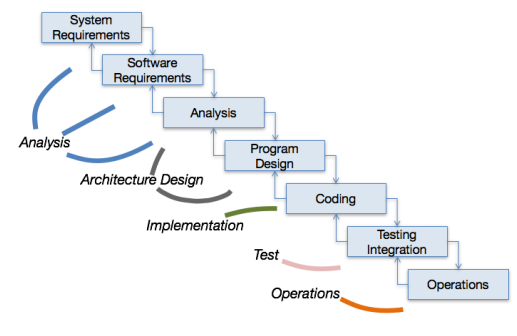
Useful when phases are dependent on each other, as each step builds upon the previous. Has difficulties when encountering changes, as there is only feedback between neighbors.

Another popular phase model is the **V-model**:
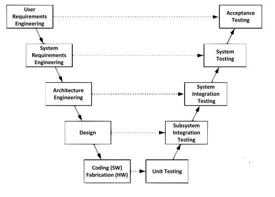
This is a good model for quality assurance, as there is a clear mapping and tight control for testing. May become to heavy-testing for some projects, and might be tedious to work with...

#### Spiral Model
Risk-based approach; specifically steps are repeated in a number of iterations, moving closer and closer to a final product and release.
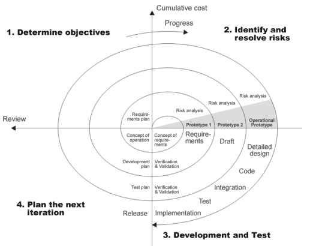

#### Incremental / Iterative
Has a similar structure to the spiral model, as it allows the system to grow step by step as features are added and scope is extended:
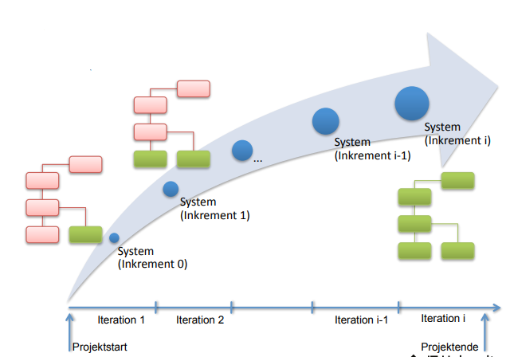

#### Prototyping

#### Agile Models
An approach that is largely change- and feedback affine; allows a high level of flexibility to all the changes that might occur throughout the process. Actively includes the client during development to ensure constant alignment on goals and implementation plans.

**Extreme Programming** was the best known and most widely used agile method. It is an 'extreme' version of iterative development, where new version may be built several times a day and all tests must be run and be accepted for every build. It covers the below practices:
- *Test-First Development*: Write the code for testing your implementation, before the implementation.
- *Pair Programming*: developers code in pairs with a drive and navigator.
- *Continuous Integration*: Code is frequently integrated into main branch. Automated builds ensure ctaching integration problems.
- *Refactoring*: Improving code structure without changing external behavior.
- *Simple Design*: avoid over-engineering and focus on delivering working functionality.
- *Collective Code Ownership*: team memebers a collectively responsible for the code base.
- *Small Releases*: Release small increments frequently for rapid feedback and validation.
- *Planning Game*: Customer and team sit together to plan and estimate work.
- *On-Site Customer*: Customer or proxy is readily available for prompt decisions.
- *Metaphor*: use a common metaphor to understand the system being built.
- *Sustainable Pace*: Prevent burnout and maintain long-term productivity, prioritize team members' wellbeing.
- *Coding Standards*: Follow a standard to ensure consistent, structured and readable code.

**SCRUM** is the most popular agile method now-a-days (including different modified versions). Largely based on trust between team members and customers, and product is broken down into a set of manageable chunks that can be implemented incrementally within a set timeframe.
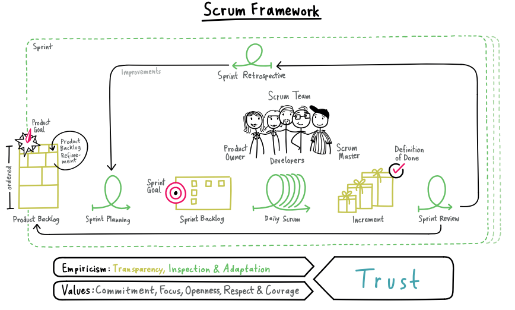


---
## Part III - Engineering Activities and Practices
### *Why do we care about Quality Assurance and program testing?*
Quality assurance is an important part of software development. It ensures that our software behaves as intended both on regular input and edge cases, and can help us demonstrate the behavior of the system. It also helps us find bugs so we can fix them before releasing to clients / users.

Testing is aimed at **breaking** the system and finding bugs / faults! Tetsing can reveal presence of errors, but it cannot prove their absence; there is no way to guarantee that we cover every possible edge use case. We consider three different terms describing errors during testing:
- *Fault*: The mechanical or algorithmic cause of an erroneous state ("bug")
- *Erroneous state*: The system is in a state such that further processing by the system can lead to a failure.
- *Failure*: Any deviation of the observed behavior from the specified behavior.

---
### *What are the different ways to deal with faults?*
Once we discover a fault we of course seek to fix the functionality of our product. There are several differen strategies:
- *Modular Redundancy*: We keep the program as it is, but built on it for the different cases (no change in current behavior, only extension)
- *Patching*: We fix the program by modifying it to make it bahave as intended
- *Declare the Bug as a Feature*

Further we might consider how we want to find the faults:
- *Fault Avoidance*: we find all bugs before release while actively developing code; i.e. code reviews, methodology, verification of algorithms.
- *Fault Detection*: we apply testing, debugging and monitoring on a fully developed system before release, yet while it is functional enough to run fully.
- *Fault Tolerance*: handle exceptions post-release and apply modular redundancy.

---
### *What Are The Different Testing Techniques?*
One might talk about two main categories of analysis: **static analysis** and **dynamic analysis**. 

When we are talking about *static* analysis we are looking at the source code and trying to find errors present. This might involve peer-reviewing, walk-throughs and automated tools for checking standards / synatctic errors. We do not run the code, but instead investigate its validity through various channels.

When we are talking about *dynamic* analysis, we move into the world of running the code and doing testing. Here we might further consider:
- *White-box testing*: we test the internal logic of the code, f.ex. by printing values in a for-loop.
- *Black-box testing*: We test whether a given input provides the desired output. This is **unit testing**.
    - Testing all possible test cases is impossible; We use *equivalence partitioning* to find representative samples and edge cases to test.

#### Coverage
To evaluate how well our test cases cover different scenarios, we might consider three different types of coverage:
- *Statement Coverage* : C0 : Every line of code has been executed.
- *Branch Coverage* : C1 : All possible branches of if-statements etc. executed.
- *Path Coverage* : C2 : All possible branch combinations throughout the code, includign loop counts.
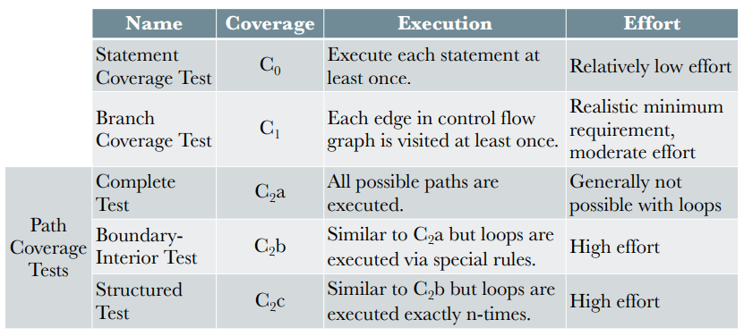

#### Levels of Tests
- **Unit Testing**: Testing individual components
- **Integration Testing**: Testing subsystems (collections of units)
    - *Bottom-Up* / *Top-Down*: Start with a branch of things and collect more and more things on higher levels OR start on top level and test smaller subsystems on lower levels recurrently.
    - *Big bang*: Put everything together at once
- **System Testing**: Testing the entire system to evaluate requirement/functionality fulfillment.
    - Subtype: Performance Tetsing - we try to violate functional requirements.
    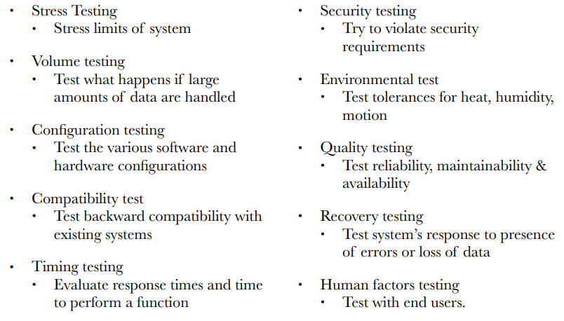
- **Acceptance Testing**: evaluate whether system meets client requirements
    - *Alpha Testing*: the intended users and developers together.
    - *Beta Testing*: software is released to users for experimenting and discover system problems
    - *Acceptance Testing*: Primarily custom systems; customer tests system and decides whether it can be accepted and deployed.

There also exists **Regression Testing** which covers testing functionality of exist8ing code, to ensure that updates did not 'break' functionality. This is *simple* and *straightforward* in automated testing setups.

#### Test Drivers and Stubs
**Driver** simulates the part of the system that calls the component.

**Stubs** simulates a component that is called by the System Under Test (SUT). Stubs come in several different types, and might sometimes be referred to as *test doubles*:
- *Dummy Object*: passed but never used; f.ex. parameter lists
- *Fake Object*: Working implementation but with shortcuts
- *Stub*: Canned answers to the calls used during testing
- *Mock Object*: Can mimic behavior of real object and deal with any expected input.

#### Integration Strategies
A popular buzz-word is **continuous integration**, which is when all team members frequently (often daily) integrate their changes into master. Each change is verified by an automated build which includes the execution of tests.

---
### *How do i implement testing in Java?*
A popular unit-testing framework in Java is **JUnit**. Below is an example of how to set up testing for a calculator:
```java
public class CalculatorTest {
    private Calculator c;

    @BeforeEach // This will be run as a setup-stage before each test case
    public void setup() {
        c = new Calculator();
    }

    @Test
    public void testMul() {
        int result = c.mul(2,2);
        assertequals(4, result); // This is the black-box testing to assert equality with the intended output
    }

    @Test
    public void sqrtOfNegative() {
        Assertions.assertThrows( // Asserting whether an action throws an error
            InvalidParameterException.class, () -> { // The error that should be thrown
                c.sqrt(-1); // Action that should throw the error
            }
        )
    }
}
```
#### Annotations:
- <code>@Test</code>: This is a Test Method
- <code>@BeforeEach</code>: This happens before each test method (setup)
- <code>@AfterEach</code>: This happens after each test method (clean up)
- <code>@BeforeAll</code>: (static) This happens once before testing anything.
- <code>@AfterAll</code>: (static) This happens once after all tests

#### Assertions:
- <code>assertEquals([message,] expected, actual)</code>: test values are equivalent
- <code>assertTrue([message,] condition)</code>: test condition is true
- <code>assertFalse([message,] condition)</code>: Test condition is false
- <code>assertNull([message,] object)</code>: Test object is null
- <code>asserNottNull([message,] object)</code>: Test object is NOT null

---
### *What is Requirement Engineering? What are the basic concepts?*
Requirement engineering is the process of establishing the services required and the constraints to which the system is to operate under. There are two main sources of different requirements:
- *User Requirements*: Statements and diagrams of the services the system provides and operational constraints. Written for CUSTOMERS.
- *System Requirements*: Defined through detailed desceriptions of system functionality / services what should be implemented; This can be seen as a "CONTRACT" between client and contractor.

Further we might consider the requirements themselves belonging to one of the two classes:
- **Functional Requirements**: Statements of services and how the system should act. Might also consider what the system should *not* do.
    - *A user shall be able to search the appointments lists for all clinics.*
    - *The system shall generate each day, for each clinic, a list of patients who are expected to attend appointments that day.*
- **Non-Functional Requirements**: Constraints on the services, f.ex. timing constraints, standards and similar. Often system-wide and not focused on an individual feature. Defines *system properties* and their *constraints*:
    - *Examples of properties are: reliability, security, response time, storage requirements, etc.*
    - *Examples of constraints are: I/O device capability, system representations, programming language, etc.*
- **verifiable** Non-Functional Requirements: The best type of these, as it is useful in Quality Assurance (QA)! How do we otherwise measure whether something is "fast" enough?

All problems should be **precise** in their phrasing, such that they will not contain any ambiguity that might lead to misunderstandings.

#### Requirement Validation
We might consider several different aspects of our requirements before accepting them, to ensure the best results overall:
- *Complete*: All features of interest described
- *Consistent*: There exist no contradictions
- *Clear / unambiguous*: Requirements have a single interpretation
- *Correct*: Described only intended feature requirements
- *Realistic*: It is possible to implement the system
- *Verifiable*: There are tests to verify fulfilling requirements
- *Traceable*: Requirements can be traced throughout the proces and functions

#### Prioritisation
It is important to consider which requirements are most important to the customer. This will be the basis for any compromises and release plans and decision making. Consider f.ex. **MoSCoW**:
- *Must*: Cannot do without
- *Should*: Really want this
- *Could*: Would like this
- *Won't*: Do not need this

---
### *Describe the Requirement Elicitation Activities*
Requirement Elicitation is about defining the use of the system through actors, scenarios and use cases and so forth. Some basic techniques for finding these are: Document analysis, observation, questionnaire, interview, focus group & prototyping.

- **Identify actors**: Which users and systems execute the functionalities and use the system?
- **Identify Scenarios**: Which different scenarios of actors interacting with the system might we consider?
    - *As-is scenario*: Describe current situation. The user describes the system.
    - *Visionary Scenario*: Describe a future system. 
    - *Evaluation Scenario*: Describe a user task for which the system will be evaluated.
    - *Training Scenario*: A step-by-step instruction for a novice user.
- **Identify Use Cases**: A description of some scenario from the actors' perspective. Contains several different sections:
    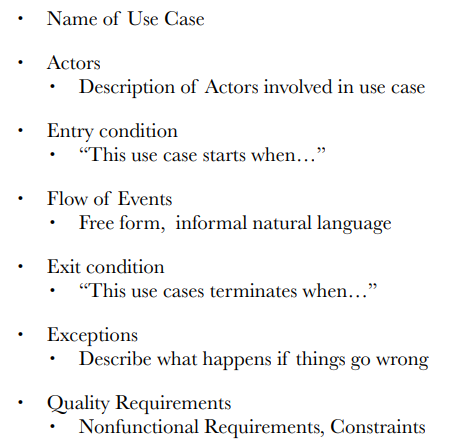
- **Refine Use Cases**: Continuously improving the Use Case from previous step. An example of a use Case:
    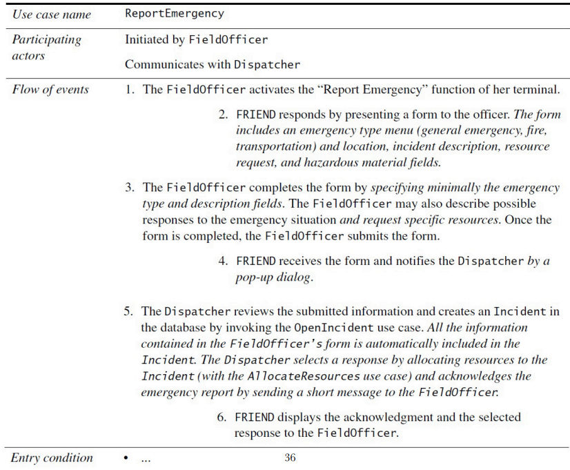
- **Identify Relationship with actors**: Identify how different actors are connected to the described use cases. Use Cases might also be *decomposed* into generalisations/specialisations using dashed arrows with keywords: *includes*, *extends*. *Generalisation* uses an arrow with empty head.
- **Identify Initial Analysis Objects**: Identify items from all of the above steps of interest to analyse. I.e. both actors, scenarios, use cases etc.
- **Identify Initial Non.Functional REQs**: Identify from the analysis objects any non-functional requirements.

---
### *What are the three C's in relation to User Stories?*
Firstly, we have the **card** which states a basic requirement / wish in a very superfluous non-detailed manner.

Then, follows the **conversation** with the product owner from which details about the story is revealed, and more detailed requirements are defined.

At last is the **confimation** for which acceptance tests confirm that a user story was implemented correctly.

#### product Backlog Iceberg
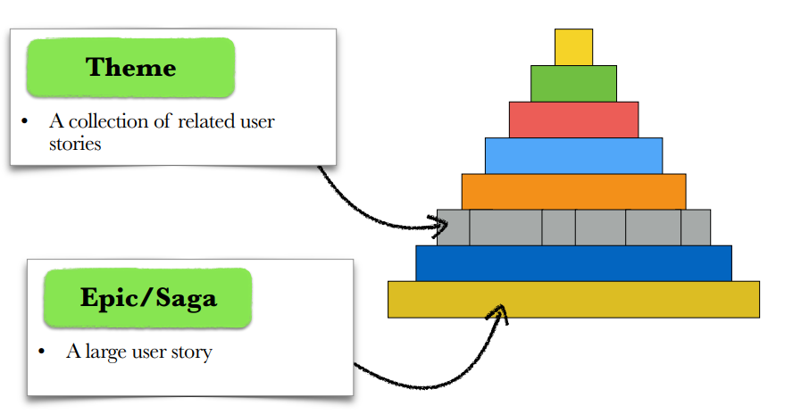

---
### *What are the SOLID principles?*
The SOLID principles are principles to build good software. We want to avoid software that is *confusing*, *rigid* (complicated to modify), *fragile* (software break unexpected places) and *immobile*. All of this happens when code is too interdependent on other parts of code in undesirable places.
- **Coupling**: The degree of interdependence between software modules or components. (We want low! it promotes modularity and maintainability)
- **Cohesion**: The degree to which the functionality within a module is related and focused on a single well-defined purpose. (We want high! leads to understandable and maintainable code)

Now, let's dive into the SOLID principles; this a collection of principles stemming from different places, and in conjunction they promoty low coupling and high cohesion!
- **S***ingle responsibility principle*: "A class should only have on, and only one, reason to change."
    - Avoid overloading a single class / object with too many functionalities.
- **O***pen/closed principle*: "Software entities should be open for extensions but closed for modifications."
    - When i want to change something, i do not need to modify code, i can just add new code with the new functionality.
- **L***iskov substitution principle*: "Derived classes must be usable through the base class interface, without the need for the user to know the difference."
    - This means subclasses should at the least have the attributes and methods working same way as the super class!
- **I***nterface segregation principle*: "Many client-specific interfaces are better than one general-purpose interface."
    - From the view-point of the client / user there are specialized interfaces for specialized task - no over-generalizations!
- **D***ependency inversion principle*: "Depend upon abstractions, do not depend upon concretions."
    - ????

---
### *Can you explain the main points of software Architecture?*
Software architecture is about the high-level structural decision made about a system. It is used to address crucial concerns about components and how they interact to enable achieving specific goals. 

There exists a number of different Architectural styles and patterns that we might consider:
- **Layered Architecture**: Organize the system as a number of interconnected layers. Supports incremental development and changes in a single layer only affects adjacent layers.
    - (Bonus) *Onion and Clean Architecture*:
    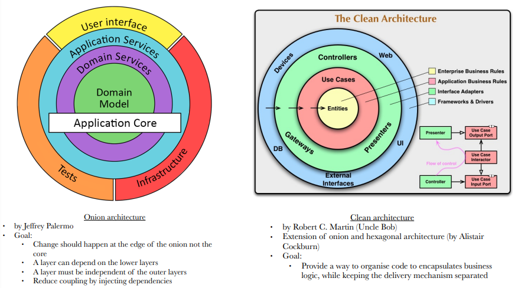
- **Pipes and Filters Architectures**: Organize a flow of functional transformations processing inputs to outputs. Good for sequential and branching architectures.
    - (Bonus) *Client-Serve Architecture*:
    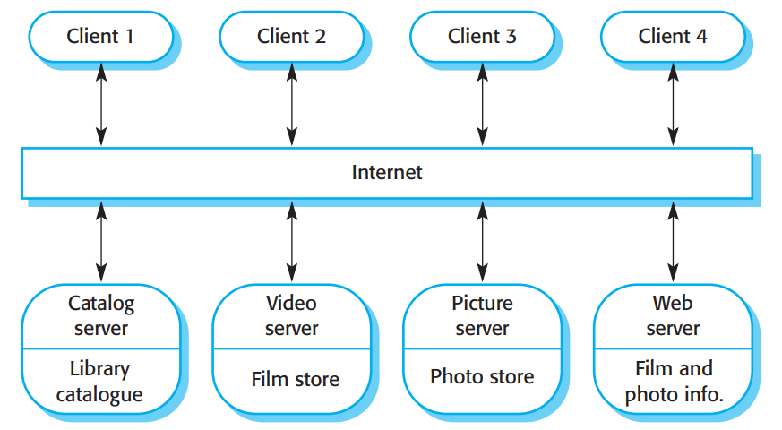
- **Model-View-Controller**: Organizes files into an architecture supporting updating other objects upon changes in another object.
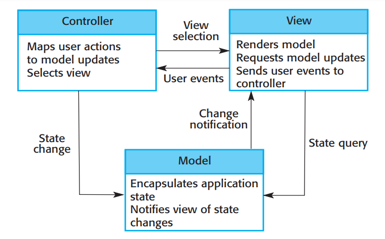

---
### *Talk to me about Design Patterns*
Design patterns are best-practices that learnt by those who practice software design. They are widely tried-tested and utilized, along with each their strengths and weaknesses. There are many different patterns, we will particularly focus on *Structural* and *Behavioral* patterns:
- **Structural Design Patterns**:
    - *Adapter*: Adapts an existing system to what a client is expecting. We do not modify existing code, but call attributes and methods from existing classes in a new class adhering to an interface.
    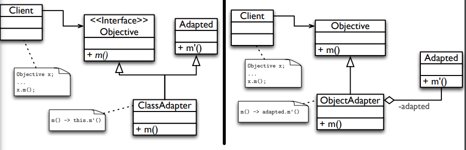
    - *Composite*: With objects in a recursive structure, allow clients to treat the complex composite model the same as a single simple object (f.ex. a line -> a square -> a square with an S-shape inside)
    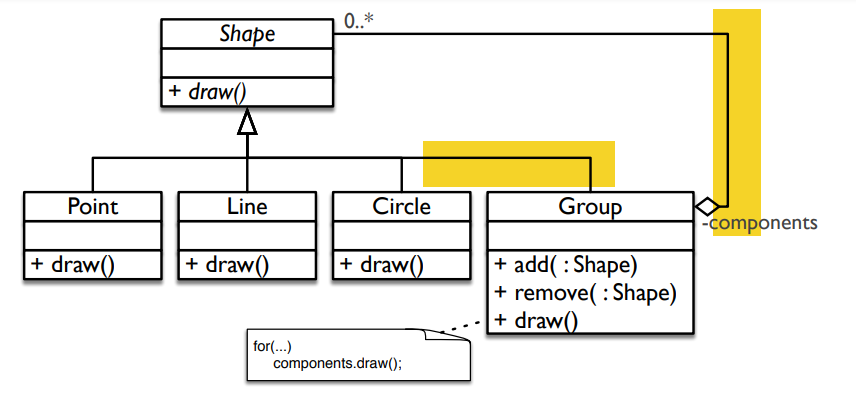
    - (Bonus) *Facade*: Provide a single unified interface for a group of dispersed functionalities. (f.ex. Graphics mapping 3D->2D) Simplifies the interface!
    - (Bonus) *Proxy*: a surrogate / placeholder for an objects exists, controlling access to the real object.
- **Behavioral Design Patterns**:
    - *Strategy*: Define a family of different algorithms that are interchangeable - then make sure algortihm useage can vary! Strategy uses *composition*. You might for example think of a network interface which might be connected using ethernet, LAN or similar.
    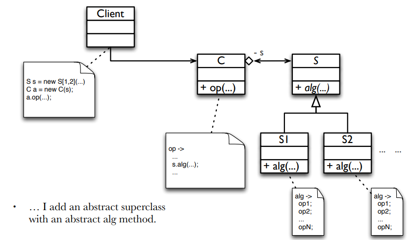
    - *Observer*: Have objects observing other objects and be notified when changes appear. In practice; observer registers in a list in the observed object. The observed object has a method calling public methods from all objects in the observer-list.
    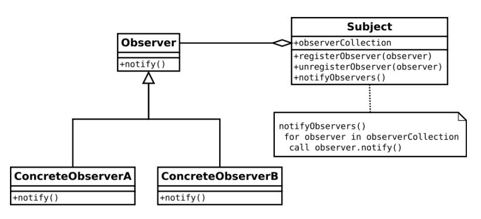
    - (Bonus) *Template Method*: Define the structure of an algorithm with some parts undefined. Subclasses define the missing parts. The subclasses only redefine few parts of the algortihm, not the overall structure!
    - (Bonus) *Chain of Responsibility*: Avoid coupling of sender and receiver of a request. Requests are hopped along a chain until an object can satisfy the request. If none can satisfy it, the request cannot be handled.

More can be read in a variety of different publications; a good ressource is the Book "Design Patterns: Elements of Reusable Object-Oriented Software" by Erich Gamma, Richard Helm, Ralph Johnson & John Vlissides.

---
## Part IV - UML Models
### *Why should I care about UML?*
UML stands for **U**nified **M**odelling **L**anguage, and offers us advantages in all stages of software development. It offers a common understanding and way of describing models that improves communication and understandability.
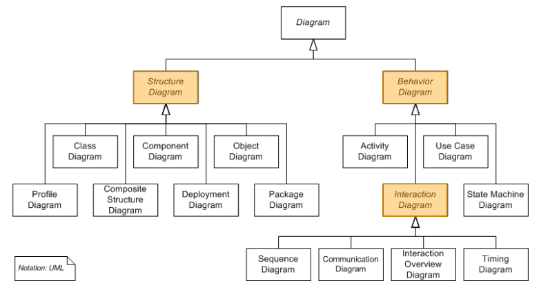

---
### *Tell me about Class Diagrams*
Class diagrams are **Structural** UML diagrams. These are used to depict classes, interfaces and relations. 

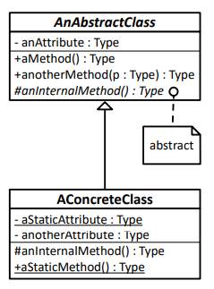
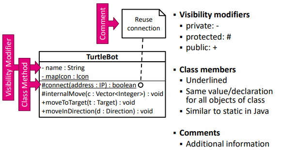
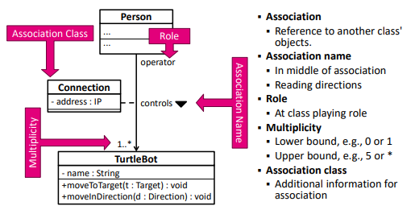
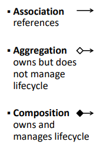
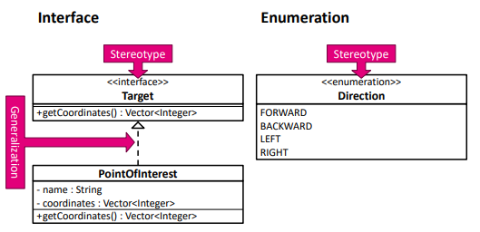

---
### *Tell me about Object Diagrams*
Object diagrams are **Structural** UML diagrams. These are used to depict instances of classes.

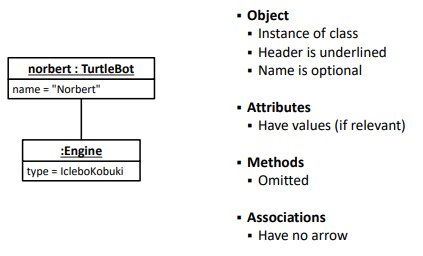

---
### *Tell me about Deployment Diagrams*
Deployment diagrams are **Structural** UML diagrams. These are used to depict the physical deployment of artifacts.

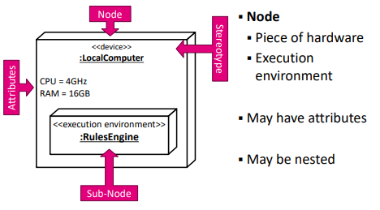
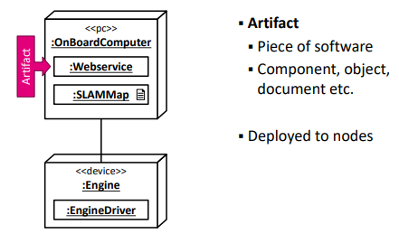
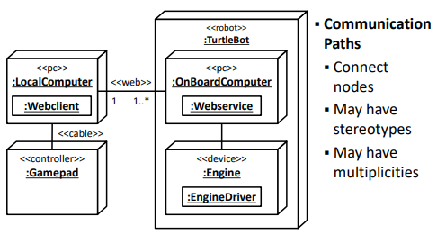

---
### *What are Activity Diagrams?*
Activity diagrams show step-wise activities and actions through a system workflow or process. It is a **Behavioral** UML Diagram type.


---
### *What are State Machine Diagrams?*
State Machine Diagrams depict protocols for transferring between different states in a program. It is a **Behavioral** UML Diagram type.

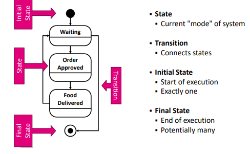
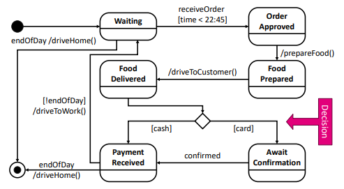
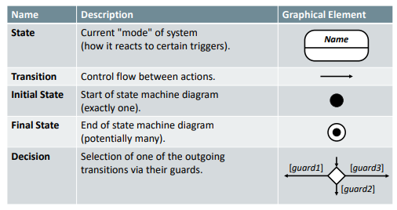

---
### *What are Sequence Diagrams?*
Sequence Diagrams show calls between objects in an example scenario. It is a **Behavioral** UML Diagram type.

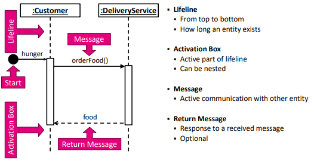
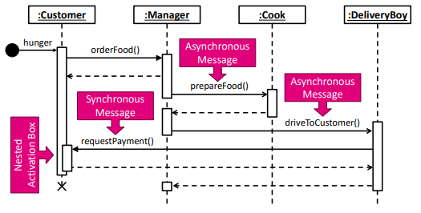
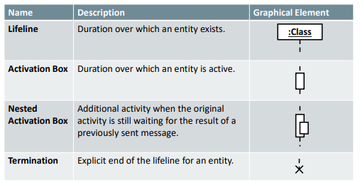
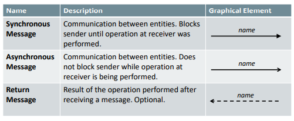